# Datenmodell FID DK - Application Profile EDM

<!-- TOC depthFrom:1 depthTo:6 withLinks:1 updateOnSave:1 orderedList:0 -->

- [Datenmodell FID DK - Application Profile EDM](#datenmodell-fid-dk-application-profile-edm)
	- [Allgemeines](#allgemeines)
	- [Namespaces](#namespaces)
		- [Zusätzliche Namespaces im FIDDK](#zusätzliche-namespaces-im-fiddk)
	- [EDM Core Classes](#edm-core-classes)
		- [edm:ProvidedCHO](#edmprovidedcho)
			- [Zusätzliche ProvidedCHO Properties im FIDDK](#zusätzliche-providedcho-properties-im-fiddk)
		- [ore:Aggregation](#oreaggregation)
			- [Zusätzliche Aggregation Properties im FIDDK](#zusätzliche-aggregation-properties-im-fiddk)
		- [edm:WebResource](#edmwebresource)
			- [Zusätzliche Webresource Properties im FIDDK](#zusätzliche-webresource-properties-im-fiddk)
	- [EDM Contextual Classes](#edm-contextual-classes)
		- [edm:Agent](#edmagent)
			- [foaf:Person](#foafperson)
				- [Zusätzliche Person Properties im FIDDK](#zusätzliche-person-properties-im-fiddk)
			- [foaf:Organization](#foaforganization)
				- [Zusätzliche Organization Properties im FIDDK](#zusätzliche-organization-properties-im-fiddk)
		- [edm:Place](#edmplace)
			- [Zusätzliche Place Properties im FIDDK](#zusätzliche-place-properties-im-fiddk)
		- [edm:Timespan](#edmtimespan)
		- [skos:Concept](#skosconcept)
			- [Zusätzliche Concept Properties im FIDDK](#zusätzliche-concept-properties-im-fiddk)
		- [edm:Event](#edmevent)
			- [Zusätzliche Event Properties im FIDDK](#zusätzliche-event-properties-im-fiddk)
	- [Statistik](#statistik)
	- [Identifier](#identifier)
		- [Format](#format)
	- [Datumsformatierung](#datumsformatierung)
		- [Beispiele](#beispiele)
	- [Modellierung von Unsicherheit](#modellierung-von-unsicherheit)
	- [XML Schema](#xml-schema)
	- [Beispieldatensätze](#beispieldatensätze)
	- [Aktuell ungelöste Probleme](#aktuell-ungelöste-probleme)

<!-- /TOC -->

**Version:** 1.0  
**Autor_in:** Julia Beck, Universitätsbibliothek Johann Christian Senckenberg Frankfurt am Main

## Allgemeines
- Nachnutzung des Metadatenstandards [EDM (Europeana Data Model)](https://pro.europeana.eu/page/edm-documentation) + universell (GLAM) + erweiterbar + flexibel + RDF basiert
- dieses Application Profile basiert auf der Originaldokumentation von [EDM](https://pro.europeana.eu/page/edm-documentation) entsprechend der [Mapping Guidelines](https://pro.europeana.eu/files/Europeana_Professional/Share_your_data/Technical_requirements/EDM_Documentation/EDM_Mapping_Guidelines_v2.4_102017.pdf), der [EDM Object Templates](https://github.com/europeana/corelib/wiki/EDMObjectTemplatesProviders) und des [EDM XML Schema](https://github.com/europeana/corelib/tree/develop/corelib-edm-definitions/src/main/resources/eu)
- die Daten liegen im FIDDK als `RDF/XML` vor
- im Folgenden eine Übersicht über EDM, seine Klassen und Properties sowie
Hinweise zu den Änderungen im FID DK (Application Profile, Änderungen sind **fett** markiert bzw ~~durchgestrichen~~)
- Nicht alles, das nicht durchgestrichen ist, wird auch tatsächlich genutzt. Teilweise wurde es nur noch nicht implementiert oder es kam noch nicht vor.
- FIDDK Note dient nur der Erklärung und entspricht nicht zwingend der Anzeige im FID Portal.
- :warning: Dies ist ein Draft und kann sich noch ändern

## Namespaces
- `dc`: http://purl.org/dc/elements/1.1/
- `dcterms`: http://purl.org/dc/terms/
- `edm`: http://www.europeana.eu/schemas/edm/
- `ore`: http://www.openarchives.org/ore/terms/
- `owl`: http://www.w3.org/2002/07/owl#
- `rdf`: http://www.w3.org/1999/02/22-­rdf-­syntax-­ns#
- `foaf`: http://xmlns.com/foaf/0.1/
- `skos`: http://www.w3.org/2004/02/skos/core#
- `rdau`: http://www.rdaregistry.info/Elements/u/
- `wgs84_pos`: http://www.w3.org/2003/01/geo/wgs84_pos#
- `crm`: http://www.cidoc-­crm.org/cidoc-­crm/
- `cc`: http://creativecommons.org/ns#

### Zusätzliche Namespaces im FIDDK
- `bibo`: http://purl.org/ontology/bibo/
- `rdau`: http://rdaregistry.info/Elements/u/
- `bf`: http://id.loc.gov/ontologies/bibframe/

Der DM2E Namespace ist über den Link http://onto.dm2e.eu/schemas/dm2e/ nicht mehr erreichbar und wahrscheinlich deprecated. Er wird seit Oktober 2020 nicht mehr verwendet, und wurde durch bibframe und rdau properties vollständig ersetzt.

## EDM Core Classes
`edm:ProvidedCHO`, `ore:Aggregation` und `edm:WebResource` repräsentieren Informationen über das Cultural Heritage Object. Im Gegensatz zu den kontextuellen Klassen, die Personen/Körperschaften, Orte, Ereignisse, Konzepte oder Epochen beschreiben, die mit dem Objekt in Relation stehen.

### edm:ProvidedCHO
Beschreibt ein Cultural Heritage Object (CHO), im Fall des FIDDK ein Objekt wie z.B. Buch, Programmheft, Grafik, Fotografie, Kostüm, Theaterzettel, Plakat, Video, Brief, ...). Es steht im Gegensatz zur `edm:WebResource`, die eine digitale Repräsentation des physischen Objekts abbildet.
- Im FID DK kann das CHO auch abstrakt sein, da es in EDM keine Klasse für das Werk oder die Produktion gibt. So werden im FIDDK Inszenierungsbeschreibungen, Produktionen und Werke ebenfalls als `edm:ProvidedCHO` abgebildet und über `dc:type` als solche gekennzeichnet.
- Bei Angaben zu Personen, die mit dem Provided CHO in Verbindung stehen, soll bevorzugt auf Normdaten in `foaf:Person` oder `foaf:Organzation` verlinkt werden und ein Literal nur benutzt werden, wenn keine Normdaten vorhanden sind.
- Sprachangaben für textuelle Angaben wie z.B. bei `dc:description` werden dem XML Standard entsprechend als Attribut `@xml:lang` mit *ISO 639-1* angegeben, s. https://www.w3.org/TR/REC-xml/#sec-lang-tag bzw. https://tools.ietf.org/html/rfc4646#section-2.2.1  
- Sofern nicht anders angegeben, wird der Originaldefinition in EDM Note gefolgt.

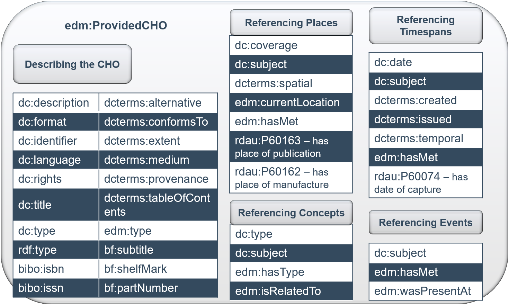
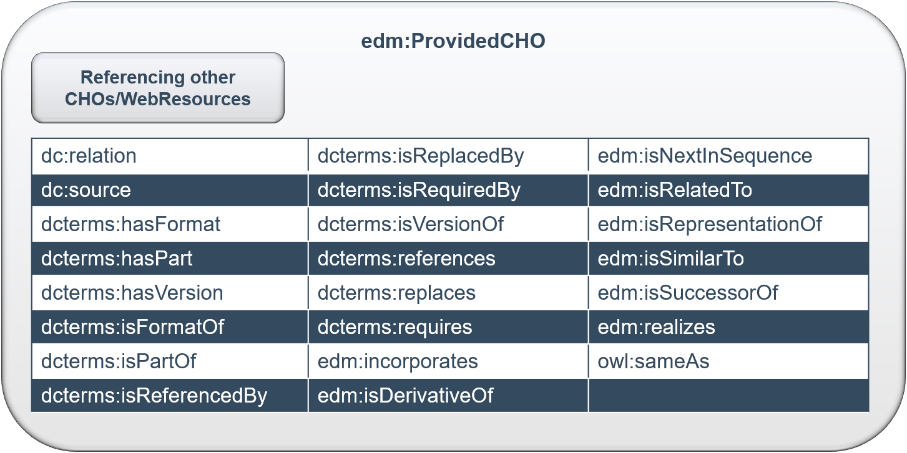
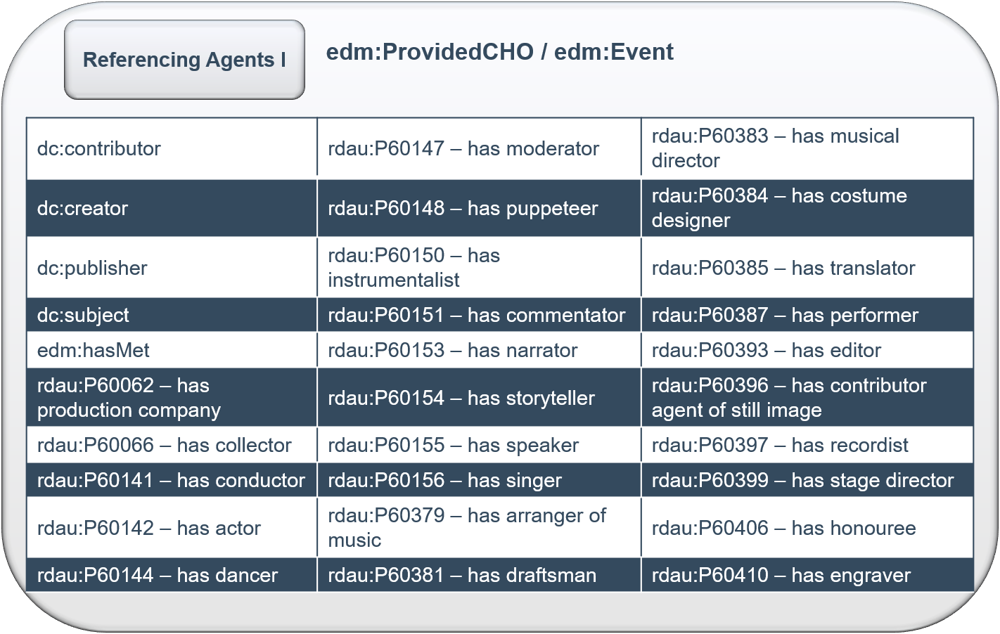
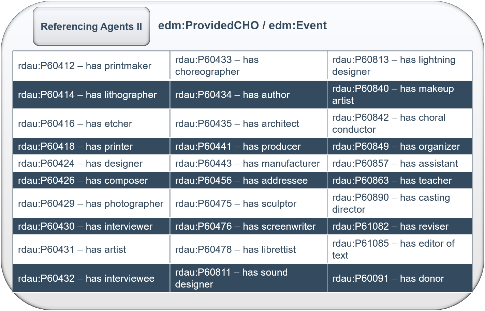

Properties | Value type | Cardinality | EDM Note | FIDDK Note | Display German | Display English
------------|------------|------------|------------|------------|------------|------------|
`dc:contributor` | literal or reference to Agent | min 0, max unbounded | Use for contributors to the CHO. If possible supply the identifier of the contributor from an authority source. Providers with richer role terms can elect to map a subset to `dc:contributor` and others to `dc:creator`. Repeat for multiple contributors. `<dc:contributor>Maria Callas</dc:contributor>`   or create a reference to an instance of the Agent class   `<dc:contributor rdf:resource=“http://www.example.com/MariaCallas”/>` | Beitragende; allgemeinste Tätigkeitsform; Nutzung im FIDDK, wenn sonst nichts zutrifft | Beitragende*r | Contributor
`dc:coverage` | literal or reference | min 0, max unbounded - one of `dc:subject`, `dc:type`, `dcterms:spatial` or `dcterms:temporal` is mandatory | The spatial or temporal topic of the CHO. Use the more precise `dcterms:spatial` or `dcterms:temporal` properties if the data will support it. `<dc:coverage>1995-­1996</dc:coverage>` or `<dc:coverage>Berlin</dc:coverage>`   or create a reference to an instance of a contextual class, for example, a Place class   `<dc:coverage rdf:resource=“http://sws.geonames.org/2950159”/>` | bisher keine Notwendigkeit für dieses Property | - | -
`dc:creator` | literal or reference to Agent | min 0, max unbounded | For the creator of the CHO. If possible supply the identifier of the creator from an authority source. Repeat for multiple creators. `<dc:creator>Shakespeare, William</dc:creator>` or create a reference to an instance of the Agent class `<dc:creator rdf:resource=“http://viaf.org/viaf/96994048”/>` | Urheber, geistiger Schöpfer; wenn Materialtyp bekannt, wird im FIDDK für gewöhnlich eine genauere Angabe wie ("has author") oder ("has photographer") bevorzugt | Urheber*in | Creator
~~`dc:date`~~ | ~~literal or reference to Timespan~~ | ~~min 0, max unbounded~~ | ~~Use for a significant date in the life of the CHO. Europeana recommends date conforming to ISO 8601 starting with the year and with hyphens (YYYY-­MMDD). NB: other EDM elements are relevant for expressing dates of different events in the life of the CHO: `dcterms:temporal`, `dcterms:created` and `dcterms:issued`. Be careful and choose the most appropriate one! `<dc:date>Early 20th century</dc:date>` or `<dc:date>1919</dc:date>` or create a reference to an instance of the TimeSpan class `<dc:date rdf:resource=“http://semium.org/time/19xx_1_third”/>`~~ | allgemeinste Form der Datumsangabe; im FIDDK nicht genutzt, da die anderen (`dcterms:temporal`,`dcterms:created`,`dcterms:issued`) bevorzugt werden | - | -
`dc:description` | literal or reference | min 0, max unbounded - either `dc:description` or `dc:title` is mandatory | A description of the CHO. If there is no `dc:description` for an object, there must be a `dc:title`. If both are available, provide both.  `<dc:description>Illustrated guide to airport markings and lighting signals, with particular reference to SMGCS (Surface Movement Guidance and Control System) for airports with low visibility conditions.</dc:description>` | Beschreibung; hier werden im FIDDK auch alle Felder untergebracht, die (bisher) keine eigene Property haben, z.B. Farbe; in dem Fall leitet der Name der Property die Beschreibung ein, z.B.  `<dc:description xml:lang="de">Farbe: blau</dc:description>`; mandatory, falls kein `dc:title`; Sprachtag, sofern bekannt | Beschreibung | Description
`dc:format` | literal or reference to Concept | min 0, max unbounded | Use for the terms generally applied to indicate the format of the cultural heritage object or the file format of a born digital object. Use the value “3D­‐PDF” if appropriate. `<dc:format>paper</dc:format>` | Format im Sinne von Dateiformat, Datenträger bzw.  physisches Trägermedium; im FIDDK selten genutzt, da selten explizit angegeben, im Moment nicht angezeigt. | - | -
`dc:identifier` | literal | min 0, max unbounded | An identifier of the original CHO. `<dc:identifier>RP-­T-­1952-­380</dc:identifier>` | Jegliche Art von angegebenen Identifiern des Objekts. Werden nicht angezeigt. | - | -
`dc:language` | literal | min 0, max unbounded | The language of text CHOs and also for other types of CHO if there is a language aspect. Mandatory for TEXT objects, strongly recommended for other object types with a language element. Best practice is to use ISO 639 two-­or-three-letter primary language tags. Repeat for multiple languages. We also recommend the use of the ISO 639-­2 code for no linguistic content (ZXX). `<dc:language>it</dc:language>` | Sprache; keine Unterscheidung nach Sprache des Originals / Übersetzung usw.; im FIDDK *ISO 639-2*; Achtung das `@xml:lang` Attribut ist allerdings *ISO 639-1*; Empfehlung für zxx für nichtsprachliche Inhalte, sofern bekannt | Sprache | Language
`dc:publisher` | literal or reference to Agent | min 0, max unbounded |  The name of the publisher of the CHO. If possible supply the identifier of the publisher from an authority source. `<dc:publisher>Oxford University Press</dc:publisher>` or create a reference to an instance of the Agent class `<dc:publisher rdf:resource=“http://www.oup.com/”/>` | Verlag | *an erster Stelle innerhalb von* Erschienen | *first position of* Published
`dc:relation` | literal or reference to CHO | min 0, max unbounded | The name or identifier of a related resource, generally used for other related CHOs. Cf `edm:isRelatedTo`. `<dc:relation>maps.crace.1/33</dc:relation>` (Shelf mark) or to provide a link to another object:  `<dc:relation rdf:resource=“http://www.identifier/relatedObject”/>` | Generelle Verlinkung ähnlicher oder in Beziehung stehender Objekte (nicht Konzepte); bei Hierarchien besser `dcterms:isPartOf` | |  
`dc:rights` | literal or reference | min 0, max unbounded | Use to give the name of the rights holder of the CHO if possible or for more general rights information. (Note that the controlled `edm:rights` property relates to the digital objects and applies to the `edm:WebResource` and/or `edm:Aggregation`). `<dc:rights>Copyright © British Library Board</dc:rights>` | Rechteangaben für das Objekt; Kontrolliertes Vokabular wäre hier schön, aber im FIDDK aufgrund der vielen Freitextangaben nicht möglich; hier auch Angaben zu Open Access | Rechteangaben | Rights Statement
`dc:source` | literal or reference to CHO | min 0, max unbounded | A related resource from which the described resource is derived in whole or in part i.e. the source of the original CHO. (Not the name of the content holder: for this see `edm:dataProvider`.)  `<dc:source>Security Magazine pp 3‐12</dc:source>` | Quellenangabe / Herkunft, nicht Datengeber_in
`dc:subject` | literal or reference to **Agent**/Concept/**Event**/**Place** | min 0, max unbounded - one of `dc:subject`, `dc:type`, `dcterms:spatial` or `dcterms:temporal` is mandatory | The subject of the CHO. One of `dc:subject` or `dc:type` or `dcterms:spatial` or `dcterms:temporal` must be provided; if more than one of these properties is available, please provide them all. High-­level `dc:subject` values like 'archaeology' are allowed, especially when there is no other subject that can be easily filled in. `<dc:subject>trombone</dc:subject>` or create a reference to an instance of the Concept class `<dc:subject rdf:resource=“http://id.loc.gov/authorities/subjects/sh85137992"/>` | Schlagwort / Topic; im FIDDK **nicht nur für Konzepte**, sondern auch verschlagwortete Personen/Körperschaften/Ereignisse/Orte; bevorzugt als Referenz
`dc:title` | literal | min 0, max ~~unbounded~~ **1** - either `dc:title` or `dc:description` is mandatory | A name given to the CHO. `dc:title` should be present; but if there is no `dc:title` available, it is acceptable to have `dc:description` instead. `dc:title` and `dc:description` should be distinct. Exact translations of the title can be provided using appropriate xml language attributes.  `<dc:title xml:lang=“en”>Eight Weeks</dc:title>`  `<dc:title xml:lang=“it”>Ocho semanas</dc:title>` | Titel (entspricht Einheitssachtitel); Sprachangabe, sofern bekannt; im FIDDK ist der Titel nicht wiederholbar, weitere Sprachen finden sich unter `dcterms:alternative`
`dc:type` | literal or reference to Concept | min ~~0~~ **1**, max unbounded - one of `dc:subject`, `dc:type`, `dcterms:spatial` or `dcterms:temporal` is mandatory | The nature or genre of the CHO. Ideally the term(s) will be taken from a controlled vocabulary. One of `dc:type` or `dc:subject` or `dcterms:spatial` or `dcterms:temporal` must be provided; if more than one of these properties is available, please provide them all. `dc:type` should not be (strictly) identical to `edm:type`. `<dc:type>Book</dc:type>` or `<dc:type>trombone</dc:type>` or create a reference to an instance of the Concept class `<dc:type rdf:about=“http://www.mimo-­db.eu/HornbostelAndSachs/356/”>` | Objektart; im FIDDK aktuell kein kontrolliertes Vokabular, soll aber auf GND basieren; im FIDDK mandatory, falls kein Typ ermittelbar wird *Druckerzeugnis* angenommen
`dcterms:alternative` | literal | min 0, max unbounded | Any alternative title of the CHO including abbreviations or translations that may not be exact. `<dcterms:alternativexml:lang=“en”>Eight weeks: a novel</dcterms:alternative>` | Alternative Titel, übersetzte Titel; Sprachangabe sofern bekannt
~~`dcterms:conformsTo`~~ | ~~literal or reference~~ | ~~min 0, max unbounded~~ | ~~An established standard to which the CHO conforms.`<dcterms:conformsTo>W3C WCAG 2.0</dcterms:conformsTo>` (conforms to web content accessibility guidelines). Or link to the resource `<dcterms:conformsTordf:resource=“http://www.w3.org/TR/WCAG/”/>`~~ | Für Angaben zu Standards, denen das CHO entspricht; im FIDDK bisher nicht vorgekommen
`dcterms:created` | literal or reference to Timespan | min 0, max unbounded | The date of creation of the CHO. Europeana recommends date conforming to ISO 8601 starting with the year and with hyphens (YYYY-­MMDD). NB: other EDM elements are relevant for expressing dates of different events in the life of the CHO: `dc:date`, `dcterms:temporal` and `dcterms:issued`. Be careful and choose the most appropriate one! `<dcterms:created>Mid 16th century</dcterms:created>` or `<dcterms:created>1584</dcterms:created>` or create a reference to an instance of the TimeSpan class `<dcterms:created rdf:resource=“http://semium.org/time/15xx_3_third”/>` | Datum der Erstellung/Herstellung/Kreation des CHO; als Datum formatiert; Nicht Erscheinungs-/Veröffentlichungsdatum
`dcterms:extent` | literal or reference | min 0, max unbounded | The size or duration of the CHO. `<dcterms:extent>13 cm</dcterms:extent>` (the width of an original object). `<dcterms:extent>34 minutes</dcterms:extent>` (the duration of an audio file). | Umfang (auch Seitenzahl) / Größe / Maße / Anzahl (bei Konvolut) / Dauer des CHO
`dcterms:hasFormat` | literal or reference to CHO | min 0, max unbounded | A resource related to the CHO that is substantially the same as the CHO but in another format. `<dcterms:hasFormat>http://upload.wikimedia.org/wikipedia/en/f/f3/Europeana_logo.png</dcterms:hasFormat>` for a png image file of the described tiff resource. Or as a link to a resource `<dcterms:hasFormat rdf:resource=“http://upload.wikimedia.org/wikipedia/en/f/f3/Europeana_logo.png’’/>` | Referenz auf weitere Repräsentation des CHO in anderem Format (kann auch innerhalb der WebResource angegeben werden); dieses CHO ist in dem Fall das Originalformat (vgl. `dcterms:isFormatOf`) bisher im FIDDK nicht vorgekommen
`dcterms:hasPart` | literal or reference to CHO | min 0, max unbounded | A resource that is included either physically or logically in the CHO. It is possible to use either `dcterms:isPartOf` or `dcterms:hasPart` to express relation between objects in a hierarchy. However in many cases (especially when a parent object has many children) it is preferable to use `dcterms:isPartOf`.  `<dcterms:hasPart>Vol.2. Issue 1</dcterms:hasPart>`. | CHO hat hierarchisch untergeordnete andere CHOs (Artikel in Zeitschrift, Teil einer Sammlung, ...); im FIDDK wird nur das Inverse `dcterms:isPartOf` benutzt, weil die Menge der "Kind"objekte sehr groß sein kann
`dcterms:hasVersion` | literal or reference to CHO | min 0, max unbounded | Another, later resource that is a version, edition or adaptation of the CHO demonstrating substantive changes in content rather than format.`<dcterms:hasVersion>The Sorcerer’s Apprentice (translation by Edwin Zeydel, 1955)</dcterms:hasVersion>`. In this example the 1955 translation is a version of the described resource. | Referenz zu einer anderen Version (z.B. Übersetzung, Adaption) des CHO; in dem Fall ist das CHO die Originalversion (vgl. `dcterms:isVersionOf`); bisher im FIDDK nicht vorgekommen
`dcterms:isFormatOf` | literal or reference to CHO | min 0, max unbounded | Another resource that is substantially the same as the CHO but in another format. `<dcterms:isFormatOf>Europeana_logo.tiff</dcterms:isFormatOf>` where the resource being described is a png image file. | CHO ist Version eines Objekts in anderem Format
`dcterms:isPartOf` | literal or reference to CHO | min 0, max unbounded | A resource in which the CHO is physically or logically included. This property can be used for objects that are part of a hierarchy and will be used to support an appropriate display in the portal. For that purpose it will be necessary to supply a reference as the value. See the Task Force report 6 on representing hierarchical entities. It is possible to use either `dcterms:isPartOf` or `dcterms:hasPart` to express relation between objects in a hierarchy. However in many cases (especially when a parent object has many children) it is preferable to use `dcterms:isPartOf`. `<dcterms:isPartOf>Crace Collection of Maps of London</dcterms:isPartOf>` Or link to parent object if part of a hierarchy of CHOs `<dcterms:isPartOf rdf:resource=“http://data.europeana.eu/item/08701/1B0BACAA44D5A807E43D9B411C9781AAD2F96E65”/>` | CHO hat hierarchisch übergeordnete andere CHOs (Zeitschrift, Sammlung, Reihe, ...); ein "Kind"objekt kann zu mehreren "Eltern"objekten gehören; bevorzugt als Referenz, Literal aber ebenfalls möglich; im FIDDK wird dieses Property anstatt des inversen `dcterms:hasPart` genutzt
`dcterms:isReferencedBy` | literal or reference to CHO | min 0, max unbounded | Another resource that references, cites or otherwise points to the CHO.  `<dcterms:isReferencedBy>Till, Nicholas (1994) Mozart and the Enlightenment: Truth, Virtue and Beauty in Mozart’s Operas, W. W. Norton & Company</dcterms:isReferencedBy>` | Referenz zu anderem Objekt, das dieses CHO referenziert; Inverses: `dcterms:references`; im FIDDK bisher nicht vorgekommen
`dcterms:isReplacedBy` | literal or reference to CHO | min 0, max unbounded | Another resource that supplants, displaces, or supersedes the CHO. `<dcterms:isReplacedBy>http://dublincore.org/about/2009/01/05/bylaws/</dcterms:isReplacedBy>` where the resource described is an older version (http://dublincore.org/about/2006/01/01/bylaws/) or link `<dcterms:isReplacedBy rdf:resource=“http://dublincore.org/about/2009/01/05/bylaws/”/>` | Referenz zu anderem Objekt, das dieses CHO ersetzt; Inverses: `dcterms:replaces`; im FIDDK bisher nicht vorgekommen
`dcterms:isRequiredBy` | literal or reference to CHO | min 0, max unbounded | Another related resource that requires the CHO to support its function, delivery or coherence `<isRequiredBy>http://www.myslides.com/myslideshow.ppt</isRequiredBy>` where the image being described is required for an online slideshow | Referenz zu anderem Objekt, das für seine Funktionalität/Kohärenz dieses CHO benötigt/erfordert; Inverses: `dcterms:requires`; im FIDDK bisher nicht vorgekommen
`dcterms:issued` | literal or reference to Timespan | min 0, max unbounded | Date of formal issuance or publication of the CHO. Europeana recommends date conforming to ISO 8601 starting with the year and with hyphens (YYYY-­MMDD). NB: other EDM elements are relevant for expressing dates of different events in the life of the CHO: `dc:date`, `dcterms:temporal` and `dcterms:created`. Be careful and choose the most appropriate one! `<dcterms:issued>1993</dcterms:issued>` or create a reference to an instance of the TimeSpan class `<dcterms:issued rdf:resource=“http://semium.org/time/17xx_3_third”/>` (late 18thcentury) | Erscheinungsdatum/Veröffentlichungsdatum; als Datum formatiert; nicht Datum der Herstellung/Kreation
`dcterms:isVersionOf` | literal or reference to CHO | min 0, max unbounded | Another, earlier resource of which the CHO is a version, edition or adaptation, demonstrating substantive changes in content rather than format. `<dcterms:isVersionOf>The Sorcerer’s Apprentice<dcterms:isVersionOf>`. In this example The Sorcerer’s Apprentice (translation by Edwin Zeydel, 1955) is the resource being described. | CHO ist andere Version (Übersetzung/Ausgabe/Adaption) eines Objekts; nicht das Original (vgl. `dcterms:hasVersion`); im FIDDK bisher nicht vorgekommen
`dcterms:medium` | literal or reference to Concept | min 0, max unbounded | The material or physical carrier of the CHO. `<dcterms:medium>metal</dcterms:medium>` | Material oder Trägermedium des CHO
`dcterms:provenance` | literal or reference | min 0, max unbounded | A statement of changes in ownership and custody of the CHO since its creation. Significant for authenticity, integrity and interpretation. `<dcterms:provenance>Donated to The National Library in 1965</dcterms:provenance>` | Provenienzangabe
`dcterms:references` | literal or reference to CHO | min 0, max unbounded | Other resources referenced, cited or otherwise pointed to by the CHO.  `<dcterms:references>Honderd jaar Noorse schilderkunst</dcterms:references>` | CHO referenziert andere Objekte; Inverses: `dcterms:isReferencedBy`; im FIDDK noch nicht vorgekommen
`dcterms:replaces` | literal or reference to CHO | min 0, max unbounded | A related resource that is supplanted, displaced, or superseded by the CHO. `<dcterms:replaces>http://dublincore.org/about/2006/01/01/bylaws/</dcterms:replaces>` where the resource described is a newer version (http://dublincore.org/about/2009/01/05/bylaws/) or link to resource `<dcterms:replaces rdf:resource=“http://dublincore.org/about/2006/01/01/bylaws/”/>` | CHO ersetzt andere Objekte; Inverses: `dcterms:isReplacedBy`; im FIDDK noch nicht vorgekommen
`dcterms:requires` | literal or reference to CHO | min 0, max unbounded | Another resource that is required by the described resource to support its function, delivery or coherence. `<dcterms:requires>http://ads.ahds.ac.uk/project/userinfo/css/oldbrowsers.css</dcterms:requires>` where the resource described is an HTML file at http://ads.ahds.ac.uk/project/userinfo/digitalTextArchiving.html | CHO verlangt andere Objekte für Funktionalität/Kohärenz; Inverses: `dcterms:isRequiredBy`; im FIDDK noch nicht vorgekommen
`dcterms:spatial` | literal or reference to Place | min 0, max unbounded - one of `dc:subject`, `dc:type`, `dcterms:spatial` or `dcterms:temporal` is mandatory | Spatial characteristics of the CHO. i.e. what the CHO represents or depicts in terms of space (e.g. a location, co-­ordinate or place). Either `dcterms:spatial` or `dc:type` or `dc:subject` or `dcterms:temporal` must be provided; if more than one of these properties is available, please provide them all. `dcterms:spatial` is used to record the place depicted in the CHO and other locations associated with it as opposed to `edm:currentLocation` which is used only to record the place where the CHO is currently held (e.g. a museum or gallery). Be careful to choose the most appropriate one! `<dcterms:spatial>Portugal</dcterms:spatial>` or create a reference to an instance of the Place class `<dcterms:spatial rdf:resource=“http://sws.geonames.org/2264397/”/>` | Allgemeine, nicht spezifische Referenz auf Ort (ohne Angabe welcher Art (z.B. Erscheinungsort) die Beziehung ist); im FIDDK werden (wenn möglich) genauere Referenzen `rdau:P60162` oder `rdau:P60163` bevorzugt
`dcterms:tableOfContents` | literal or reference | min 0, max unbounded | A list of sub­‐units of the CHO.  `<dcterms:tableOfContents>Chapter 1. Introduction, Chapter 2. History </dcterms:tableOfContents>` | Inhaltsverzeichnis / Bestandsverzeichnis / Auflistung der Inhalte
`dcterms:temporal` | literal or reference to Timespan | min 0, max unbounded - one of `dc:subject`, `dc:type`, `dcterms:spatial` or `dcterms:temporal` is mandatory | Temporal characteristics of the CHO. i.e. what the CHO is about or depicts in terms of time (e.g. a period, date or date range.)Either `dcterms:temporal` or `dc:type` or `dc:subject` or `dcterms:spatial` must be provided; if more than one of these properties is available, please provide them all. Europeana recommends date conforming to ISO 8601 starting with the year and with hyphens (YYYY-­MMDD). NB: other EDM elements are relevant for expressing dates of different events in the life of the CHO: `dc:date`, `dcterms:created` and `dcterms:issued`. Be careful and choose the most appropriate one! `<dcterms:temporal>Roman Empire</dcterms:temporal>`or create a reference to an instance of the TimeSpan class`<dcterms:temporal rdf:resource=“http://semium.org/time/roman_empire”/>` | Allgemeine, nicht spezifische Datumsangabe (ohne Angabe welcher Art (z.B. Erscheinungsdatum) die Beziehung ist); im FIDDK werden (wenn möglich) genauere Referenzen `dcterms:created` bzw. `dcterms:issued` bevorzugt
`edm:currentLocation` | literal or reference | min 0, min 1 | The geographic location whose boundaries presently include the CHO. This location must have a position within an established positioning system: a location with coordinates or address or inside another location that has a position, such as a room within a (museum) building. Ideally this position should be provided with the value of the property, either by using a reference (to a Place entity) that has coordinates or an address attribute, or as a simple literal. `edm:currentLocation` is used only to record the place where the CHO is currently held (e.g. a museum or gallery); `dcterms:spatial` is used to record the place depicted in the CHO and other locations associated with it. Be careful to choose the most appropriate one! `<edm:currentLocation rdf:resource=“http://sws.geonames.org/2950159”/>` (Identifier for Berlin) | Aktueller Standort des CHO
`edm:hasMet` | reference to Agent/Event/Place/Timespan | min 0, max unbounded | The identifier of an agent, a place, a time period or any other identifiable entity that the CHO may have “met” in its life. `<edm:hasMet rdf:resource=“http://viaf.org/viaf/96994048”/>` (Identifier for William Shakespeare)  `<edm:hasMet rdf:resource=“http://sws.geonames.org/6620265”/>` (location identifier for Shakespeare’s Globe theatre.) | Generische Beziehungen zu Personen/Körperschaften/Orten/Epochen; spezifischere Beziehungen (`dcterms:spatial`,`dcterms:temporal`,...) werden im FIDDK bevorzugt
~~`edm:hasType`~~ |	~~reference to Concept or literal~~ | ~~min 0, max unbounded~~ | ~~The identifier of a concept, or a word or phrase from a controlled vocabulary (thesaurus etc) giving the type of the CHO. E.g. Painting from the AAT thesaurus. This property can be seen as a super-­property of e.g. `dc:format` or `dc:type` to support “What” questions. `<edm:hasType>Painting</edm:hasType>`~~ | Übergeordnete Property für `dc:format` und `dc:type`; im FIDDK werden nur die untergeordneten Properties verwendet
`edm:incorporates` | reference to CHO | min 0, max unbounded | The identifier of another resource that is incorporated in the described CHO. E.g. the movie “A Clockwork Orange” incorporates Rossini’s La Gazza Ladra” in its soundtrack.  `<edm:incorporates rdf:resource=“http://www.identifier/IncorporatedResource”/>` | Referenz auf integriertes CHO; im FIDDK noch nicht vorgekommen
`edm:isDerivativeOf` | reference to CHO | min 0, max unbounded | The identifier of another resource from which the described CHO has been derived. E.g. the identifier of Moby Dick when the Italian translation is the described CHO.  `<edm:isDerivativeOf rdf:resource=“http://www.identifier/SourceResource”/>` | Referenz auf Derivat oder Weiterentwicklung; im FIDDK noch nicht vorgekommen
`edm:isNextInSequence` | reference to CHO | min 0, max unbounded | The identifier of the preceding object where both objects are part of the same overall resource. Use this for objects that are part of a hierarchy or sequence to ensure correct display in the portal.  `<edm:isNextInSequence rdf:resource=“http://www.identifier/PrecedingResource”/>` | Für die Definition einer Reihenfolge von CHOs (z.B. bei mehreren Seiten oder einer Bildreihe)
`edm:isRelatedTo` |	reference to Concept or literal | min 0, max unbounded | The identifier or name of a concept or other resource to which the described CHO is related. E.g. Moby Dick is related to XIX Century literature. Cf `dc:relation`. `<edm:isRelatedTo>Literature</edm:isRelatedTo >`Or link to resource`<edm:isRelatedTo rdf:resource=“http://www.eionet.europa.eu/gemet/concept?cp=4850”/>` | Referenz auf in Beziehung stehendes Konzept; s. auch `dc:relation` für in Beziehung stehende Objekte
`edm:isRepresentationOf` | reference to CHO | min 0, max 1 | The identifier of another object of which the described CHO is a representation. E.g. the identifier of the statue when the CHO being described is a painting of that statue.  `<edm:isRepresentativeOf rdf:resource=“http://www.identifier/RepresentedResource”/>` | Referenz auf andere Repräsentation des selben Objekts
`edm:isSimilarTo` |	reference to CHO | min 0, max unbounded | The identifier of another resource to which the described CHO is similar.  `<edm:isSimilarTo rdf:resource=“http://www.identifier/SimilarResource”/>` | Referenz auf ähnliches CHO
`edm:isSuccessorOf` |	reference to CHO | min 0, max unbounded | The identifier of a resource to which the described CHO is a successor. E.g. “The Two Towers” is a successor of “Fellowship of the Ring”.  `<edm:isSuccessorOf rdf:resource=“http://dbpedia.org/resource/The_Fellowship_of_the_Ring”/>` | Referenz auf Nachfolger/Fortsetzung des CHO (z.B. bei Buchreihe)
`edm:realizes` | reference to abstract CHO | min 0, max unbounded | If the CHO described is of type `edm:PhysicalThing` it may realize an information object. E.g. a copy of the Gutenberg publication realizes the Bible. `<edm:realizes rdf:resource=“http://www.identifier/PhysicalThing”/>` | Referenz auf abstraktes Informationsobjekt, falls aktuelles CHO ein physisches Objekt ist; :warning: kann für Realisation eines Werkes genutzt werden?
`edm:type` | literal (TEXT-VIDEO-SOUND-IMAGE-3D) | min ~~1~~ **0**, max 1 | The value must be one of the types accepted by Europeana as it will support portal functionality: TEXT, VIDEO, SOUND, IMAGE, 3D. (For 3D, when applicable, use the value “3D-­PDF” in `dc:format`) `<edm:type>IMAGE</edm:type>` (upper-­case) `<edm:type>3D</edm:type>` (upper-­case) | EDM Typ; im FIDDK aktuell nicht genutzt
`edm:wasPresentAt` | reference to Event | min 0, max unbounded | - | Referenz zu Event, das mit dem CHO in Verbindung steht (Art der Verbindung nicht genauer spezifiziert)
`owl:sameAs` | reference | min 0, max unbounded | Use to point to your own (linked data) representation of the object, if you have already minted a URI identifier for it. It is also possible to provide URIs minted by third-­parties for the object.`<owl:sameAs rdf:resource=“http://www.identifier/SameResourceElsewhere”/>` | Link zu anderer URI der Resource; nicht Originalkatalog des Datengebers, sondern LOD Resource
`rdf:type` | reference | min 0, max unbounded | - | -

#### Zusätzliche ProvidedCHO Properties im FIDDK
- Sofern nicht anders angegeben, wird der Originaldefinition der Property gefolgt.
- RDAU hätte noch weitere interessante Tätigkeitsproperties und auch um Objektbeziehungen genauer zu definieren (ist choreografische Adaption von..., Drehbuch basiert auf..., hat Libretto... usw.). So detailliert wird es jedoch selten von Datengeber_innen erfasst.
- bibo kann nicht durch rdau ersetzt werden. Es gibt zwar ISSN, aber nicht ISBN. In bibframe gibt es ISBN und ISSN nur als Klassen nicht als Properties.
- dm2e wurde durch rdau und bibframe vollständig ersetzt

Properties | Value type | Cardinality | Bibo / Bf / Rdau Note | FIDDK Note
------------|------------|------------|------------|------------|
`bibo:isbn` | literal | min 0, max 1 | ISBN | ISBN bei Büchern; Formatprüfung auf ISBN
`bibo:issn` | literal | min 0, max 1 | ISSN | ISSN bei Zeitschriften; Formatprüfung auf ISSN
`bf:partNumber` | literal | min 0, max 1 | Part or section enumeration of a title. Possible title component. | Volume, Bandangabe, Jahrgang, Nummer in Serie, Opus-Nummer
`bf:shelfMark` | literal | min 0, max 1 | Piece identifier, such as a call or other type of number. | Signatur
`bf:subtitle` | literal | min 0, max unbounded | Word, character, or group of words and/or characters that contains the remainder of the title after the main title. Possible title component. | Untertitel, Titelzusätze, nicht Untertitel in Filmen
`rdau:P60062` | literal or reference to Agent | min 0, max unbounded | "has production company" - Relates a resource to an agent who is responsible for managing the financial, technical, and organizational aspects of a production for stage, screen, sound recording, television, webcast, etc. | Produktionsfirma (Theater/Film/...)
`rdau:P60066` | literal or reference to Agent | min 0, max unbounded | "has collector" - Relates a resource to a curator that brings together resources from various sources that are arranged, described, or catalogued as a collection. | Sammler_in (nicht Kurator_in :arrow_right: gibt es in rdau auch: `rdau:P60376`)
`rdau:P60074` | literal or reference to Timespan | min 0, max unbounded | "has date of capture" - Relates a resource to a timespan associated with recording, filming, etc., the content of a resource. | Aufnahmedatum bei Mitschnitten (Audio/Video)
`rdau:P60091` | literal or reference to Agent | min 0, max unbounded | "has donor" - Relates a resource to a former owner of a resource that donated the resource to another owner. | Geber_in / Spender_in / Schenkende Person
`rdau:P60141` | literal or reference to Agent | min 0, max unbounded | "has conductor" - Relates a resource to a performer who contributes to a musical resource by leading a performing group in a musical or dramatic presentation, etc. | Dirigent_in; nicht musikalische Leitung (s. P60383)
`rdau:P60142` | literal or reference to Agent | min 0, max unbounded | "has actor" - Relates a resource to a performer that contributes to a resources by acting as a cast member or player in a musical or dramatic presentation, etc. | Schauspieler_in / Darsteller_in
`rdau:P60144` | literal or reference to Agent | min 0, max unbounded | "has dancer" - Relates a resource to a performer who contributes to a resource by dancing in a musical, dramatic, etc., presentation. | Tänzer_in
`rdau:P60147` | literal or reference to Agent | min 0, max unbounded | "has moderator" - Relates a resource to a performer who contributes to a resource by leading a program, often broadcast, where topics are discussed, usually with participation of experts in fields related to the discussion. | Moderator_in
`rdau:P60148` | literal or reference to Agent | min 0, max unbounded | "has puppeteer" - Relates a resource to a performer who contributes to a resource by manipulating, controlling, or directing puppets or marionettes in a moving image production or a musical or dramatic presentation or entertainment. | Puppenspieler_in
`rdau:P60150` | literal or reference to Agent | min 0, max unbounded | "has instrumentalist" - Relates a resource to a performer who contributes to a resource by playing a musical instrument. | Instrumentalist_in; auch: Musiker_in (in den Daten scheint mit "Musiker_in" für gewöhnlich "Instrumentalist_in" gemeint zu sein)
`rdau:P60151` | literal or reference to Agent | min 0, max unbounded | "has commentator" - Relates a resource to a performer who contributes to a resource by providing interpretation, analysis, or a discussion of the subject matter on a recording, film, or other audiovisual medium. | Kommentator_in
`rdau:P60153` | literal or reference to Agent | min 0, max unbounded | "has narrator" - Relates a resource to a performer who contributes to a resource by reading aloud or giving an account of an act, occurrence, course of events, etc. | Erzähler_in (:warning: Unterscheidung zu storyteller unklar!)
`rdau:P60154` | literal or reference to Agent | min 0, max unbounded | "has storyteller" - Relates a resource to a performer who contributes to a resource by relaying a creator's original story with dramatic or theatrical interpretation. | Erzähler_in (:warning: Unterscheidung zu narrator unklar!)
`rdau:P60155` | literal or reference to Agent | min 0, max unbounded | "has speaker" - Relates a resource to a performer who contributes to a resource by speaking words, such as a lecture, speech, etc. | Sprecher_in / Vortragende_r
`rdau:P60156` | literal or reference to Agent | min 0, max unbounded | "has singer" - Relates a resource to a performer who contributes to a resource by using his/her/their voice, with or without instrumental accompaniment, to produce music. a singer’s performance may or may not include actual words. | Sänger_in
`rdau:P60162` | literal or reference to Place | min 0, max unbounded | "has place of manufacture" - Relates a resource to a place associated with the printing, duplicating, casting, etc., of a published resource. | Herstellungsort
`rdau:P60163` | literal or reference to Place | min 0, max unbounded | "has place of publication" - Relates a resource to a place associated with the publication, release, or issuing of a published resource. | Erscheinungsort / Ort der Veröffentlichung
`rdau:P60379` | literal or reference to Agent | min 0, max unbounded | "has arranger of music" - Relates a resource to an agent who contributes to a resource by rewriting a composition for a medium of performance different from that for which a resource was originally intended. | Musikarrangement durch, Arrangeur_in Musik
`rdau:P60381` | literal or reference to Agent | min 0, max unbounded | "has draftsman" - Relates a resource to an agent who contributes to a resource by an architect, inventor, etc., by making detailed plans or drawings for buildings, ships, aircraft, machines, objects, etc. | Entwurf durch, Designer_in des Entwurfs
`rdau:P60383` | literal or reference to Agent | min 0, max unbounded | "has musical director" - Relates a resource to an agent who contributes to a resource by coordinating the activities of composers, sound editors, and sound mixers for a moving image production or for a musical or dramatic presentation or entertainment. | Musikalische Leitung; nicht Dirigent_in (s. `rdau:P60141`)
`rdau:P60384` | literal or reference to Agent | min 0, max unbounded | "has costume designer" - Relates a resource to an agent who contributes to a resource by designing costumes for a moving image production or for a musical or dramatic presentation or entertainment. | Kostümbildner_in
`rdau:P60385` | literal or reference to Agent | min 0, max unbounded | "has translator" - Relates a resource to an agent who contributes to an expression of a resource by expressing linguistic content of a resource in a language different from that of previous expressions of an original resource. | Übersetzer_in
`rdau:P60387` | literal or reference to Agent | min 0, max unbounded | "has performer" - Relates a resource to an agent who contributes to a resource by performing music, acting, dancing, speaking, etc., often in a musical or dramatic presentation, etc. | Performer_in
`rdau:P60393` | literal or reference to Agent | min 0, max unbounded | "has editor" - Relates a resource to an agent who contributes to a resource by revising or clarifying the content, or by selecting and putting together resources, or parts of resources, by one or more creators. | Herausgeber_in (:warning: siehe `rdau:P61085` "editor of text")
`rdau:P60396` | literal or reference to Agent | min 0, max unbounded | "has contributor agent of still image" - Relates a resource to an agent who contributes to a resource by supplementing a primary content with drawings, diagrams, photographs, etc. | Illustrator_in
`rdau:P60397` | literal or reference to Agent | min 0, max unbounded | "has recordist" - Relates a resource to an agent who contributes to a resource by using a recording device to capture sound or video during a recording session, including field recordings of natural sounds, folkloric events, music, etc. | Kameramann_frau / Aufnahme / Tonmann_frau
`rdau:P60399` | literal or reference to Agent | min 0, max unbounded | "has stage director" - Relates a resource to an agent who contributes to a stage resource through the general management and supervision of a performance. | Theaterregisseur_in (nutze Filmregisseur_in `rdau:P60084` für Film)
`rdau:P60406` | literal or reference to Agent | min 0, max unbounded | "has honouree" - Relates a resource to an agent who is honoured by a resource. | Geehrte_r / Preisträger_in / Ausgezeichnete_r
`rdau:P60410` | literal or reference to Agent | min 0, max unbounded | "has engraver" - Relates a resource to an agent involved in manufacturing a resource by cutting letters, figures, etc., on a surface such as a wooden or metal plate used for printing. | Stecher_in
`rdau:P60412` | literal or reference to Agent | min 0, max unbounded | "has printmaker" - Relates a resource to an agent involved in manufacturing a resource by making a relief, intaglio, or planographic printing surface. | Grafiker_in (Druckgrafik)
`rdau:P60414` | literal or reference to Agent | min 0, max unbounded | "has lithographer" - Relates a resource to an agent involved in manufacturing a resource by preparing a stone or plate for lithographic printing. | Lithograf_in
`rdau:P60416` | literal or reference to Agent | min 0, max unbounded | "has etcher" - Relates a resource to an agent involved in manufacturing a resource by subjecting metal, glass, or some other surface used for printing, to acid or another corrosive substance. | Radierer_in
`rdau:P60418` | literal or reference to Agent | min 0, max unbounded | "has printer" - Relates a resource to an agent involved in manufacturing a resource of printed text, notated music, etc., from type or plates, such as a book, newspaper, magazine, broadside, score, etc. | Drucker_in
`rdau:P60424` | literal or reference to Agent | min 0, max unbounded | "has designer" - Relates a resource to an agent who is responsible for creating a design for an object. | Designer_in des Objekts
`rdau:P60426` | literal or reference to Agent | min 0, max unbounded | "has composer" - Relates a resource to an agent who is responsible for creating a musical resource. | Komponist_in
`rdau:P60429` | literal or reference to Agent | min 0, max unbounded | "has photographer" - Relates a resource to an agent who is responsible for creating a photographic resource. | Fotograf_in
`rdau:P60430` | literal or reference to Agent | min 0, max unbounded | "has interviewer" - Relates a resource to an agent who is responsible for creating a resource by acting as an interviewer, reporter, pollster, or some other kind of agent who gathers information. | Interviewer_in
`rdau:P60431` | literal or reference to Agent | min 0, max unbounded | "has artist" - Relates a resource to an agent who is responsible for creating an original graphic design, drawing, painting, etc. | Künstler_in
`rdau:P60432` | literal or reference to Agent | min 0, max unbounded | "has interviewee" - Relates a resource to an agent who is responsible for creating a resource by responding to an interviewer, usually a reporter, pollster, or some other kind of agent who gathers information. | Interviewte Person / Interviewpartner_in / Befragte_r
`rdau:P60433` | literal or reference to Agent | min 0, max unbounded | "has choreographer" - Relates a resource to an agent who is responsible for a choreographic resource. | Choreograf_in
`rdau:P60434` | literal or reference to Agent | min 0, max unbounded | "has author" - Relates a resource to an agent who is responsible for a textual resource. | Autor_in / (Text-)Verfasser_in; es wird nicht nach "Verfasser_in des Vorworts" o.ä. unterschieden
`rdau:P60435` | literal or reference to Agent | min 0, max unbounded | "has architect" - Relates a resource to an agent who is responsible for an architectural design, including a pictorial representation intended to show how a building or other structure will look when completed. | Architekt_in (z.B. eines Theaterbaus)
`rdau:P60441` | literal or reference to Agent | min 0, max unbounded | "has producer" - Relates a resource to an agent responsible for most of the business aspects of a production for screen, sound recording, television, webcast, etc. | Produzent_in; keine Unterscheidung nach Film- und Fernsehproduzent_in
`rdau:P60443` | literal or reference to Agent | min 0, max unbounded | "has manufacturer" - Relates a resource to an agent who is responsible for printing, duplicating, casting, etc., a published resource. | Hersteller_in
`rdau:P60456` | literal or reference to Agent | min 0, max unbounded | "has addressee" - Relates a resource to an agent to whom a resource or part of a resource is addressed. | Adressat_in / Rezipient_in
`rdau:P60475` | literal or reference to Agent | min 0, max unbounded | "has sculptor" - Relates a resource to an agent who is an artist who is responsible for creating a three-dimensional resource by modeling, carving, or similar technique. | Bildhauer_in / Skulpteur_in
`rdau:P60476` | literal or reference to Agent | min 0, max unbounded | "has screenwriter" - Relates a resource to an agent who is an author of a screenplay, script, or scene. | Drehbuchautor_in
`rdau:P60477` | literal or reference to Agent | min 0, max unbounded | "has lyricist" - Relates a resource to an agent who is an author of the words of a popular song, including a song from a musical. | Lyriker_in
`rdau:P60478` | literal or reference to Agent | min 0, max unbounded | "has librettist" - Relates a resource to an agent who is an author of the words of a musical or choreographic resource such as an opera, a ballet, or other resource for the musical stage, or an oratorio. | Librettist_in
`rdau:P60811` | literal or reference to Agent | min 0, max unbounded | "has sound designer" - Relates a resource to an agent who contributes to a resource by designing and creating audio or sound components. | Sounddesigner_in / Tondesigner_in
`rdau:P60813` | literal or reference to Agent | min 0, max unbounded | "has lighting designer" - Relates a resource to an agent who contributes to a resource by designing and creating lighting components. | Lichtdesigner_in / Beleuchter_in
`rdau:P60840` | literal or reference to Agent | min 0, max unbounded | "has makeup artist" - Relates a resource to an agent who contributes to a resource by applying makeup and prosthetics for a moving image production or for a musical or dramatic presentation or entertainment. | Maskenbildner_in / Visagist_in / Maske
`rdau:P60842` | literal or reference to Agent | min 0, max unbounded | "has choral conductor" - Relates a resource to a conductor that contributes to musical resource by leading a choral performing group in a musical or dramatic presentation. | Chorleiter_in
`rdau:P60849` | literal or reference to Agent | min 0, max unbounded | "has organizer" - Relates a resource to an agent who organizes a conference, exhibition, or other event that gives rise to a resource. | Organisator_in
`rdau:P60857` | literal or reference to Agent | min 0, max unbounded | "has assistant" - Relates an agent to a colleague who helps another agent. | Assisstent_in (allgemein); Regieassisstenz hat keine gesonderte Tätigkeitsproperty
`rdau:P60863` | literal or reference to Agent | min 0, max unbounded | "has teacher" - ~~Relates an agent to an~~ **agent who instructs** ~~a related agent~~. |  Lehrer_in / Pädagoge_in; im FIDDK nicht wie in RDAU eine Beziehung zwischen Personen, sondern als Tätigkeit im allgemeinen
`rdau:P60890` | literal or reference to Agent | min 0, max unbounded | "has casting director" - Relates a resource to an agent who is responsible for most aspects of assigning parts and duties to performers. | Verantwortliche_r für das Casting
`rdau:P61082` | literal or reference to Agent | min 0, max unbounded | "has reviser" - Relates a resource to an agent who contributes to an expression by making changes to the content. | Bearbeiter_in
`rdau:P61085` | literal or reference to Agent | min 0, max unbounded | "has editor of text" - Relates a resource to an agent who contributes to an expression by amending text created by other agents in order to meet publication standards such as consistency, clarity, and style. | Redakteur_in (:warning: siehe auch `rdau:P60393` "editor")

### ore:Aggregation
Verbindet ein Objekt (provided CHO) mit den zugehörigen Webresourcen. Sofern nicht anders angegeben, wird der Originaldefinition in EDM Note gefolgt.

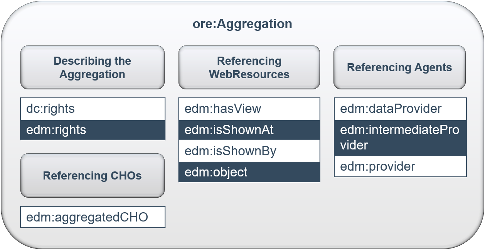

Properties | Value type | Cardinality | EDM Note | FIDDK Note
------------|------------|------------|------------|------------|
~~`ore:aggregates`~~ | ~~reference~~ |	~~min 0, max unbounded~~ | ~~(in principle only stated via `edm:hasView` and `edm:aggregatedCHO` statements)~~ | -
`edm:aggregatedCHO` |	reference to CHO |	min 1, max 1 | The identifier of the source object e.g. the Mona Lisa itself. This could be a full linked open data URI or an internal identifier.  `<edm:aggregatedCHO rdf resource=“#UEDIN:214”/>` | Link zum zugehörigen `edm:ProvidedCHO`; mandatory
`edm:dataProvider` | ~~literal or~~ reference to Agent |	min 1, max 1 | The name or identifier of the data provider of the object (i.e. the organisation providing data to an aggregator). Identifiers will not be available until Europeana has implemented its Organization profile. In the case of the data provider Zuidwestbrabants Museum, which delivers data through Erfgoedplus.be to LoCloud, the properties would look like this:`<edm:dataProvider>Zuidwestbrabants Museum</edm:dataProvider>` `<edm:intermediateProvider>Erfgoedplus.be</edm:intermediateProvider>` `<edm:provider>LoCloud</edm:provider>` | Datengeber des ProvidedCHO; im FIDDK immer Link zu `foaf:Organization` (meist mit GND, außer im Fall von BASE)
`edm:hasView` |	reference to WebResource |	min 0, max unbounded | The URL of a web resource which is a digital representation of the CHO. This may be the source object itself in the case of a born digital cultural heritage object. `edm:hasView` should only be used where there are several views of the CHO and one (or both) of the mandatory `edm:isShownAt` or `edm:isShownBy` properties have already been used. It is for cases where one CHO has several views of the same object. (e.g. a shoe and a detail of the label of the shoe) `<edm:hasView rdf:resource="http://www.mimo-­db.eu/media/UEDIN/VIDEO/0032195v.mpg"/>`  `<edm:hasView rdf:resource="http://www.mimo-­db.eu/media/UEDIN/AUDIO/0032195s.mp3"/>` | Link zu Web Resource mit Digitalisat des ProvidedCHO; wird auch genutzt, um entsprechende Katalogansicht der Datengeber_innen zu verlinken
`edm:intermediateProvider` | literal or reference to Agent |	min 0, max unbounded | The name or identifier of the intermediate organization that selects, collates, or curates data from a Data Provider that is then aggregated by a Provider from which Europeana harvests. The Intermediate Provider must be distinct from both the Data Provider and the Provider in the data supply chain. Identifiers will not be available until Europeana has implemented its Organization profile. In the case of the Erfgoedplus.be, which collects data from Zuidwestbrabants Museum and provides it to LoCloud, the properties would look like this:  `<edm:dataProvider>Zuidwestbrabants Museum</edm:dataProvider>`  `<edm:provider>LoCloud</edm:provider>` `<edm:intermediateProvider>Erfgoedplus.be</edm:intermediateProvider>` | Falls die Aggregation auf einer anderen Aggregation basiert (z.B. bei BASE), wird hier zusätzlich zum "Original"datengeber der Aggregator angegeben, über den die Daten geholt wurden
`edm:isShownAt` |	reference to WebResource |	min 0, max 1 -- ~~Either `isShownBy` OR `isShownAt` is Mandatory~~ | The URL of a web view of the object in full information context. An `edm:isShownAt` must be provided. If there is no `edm:isShownAt` for an object, there must be a `edm:isShownBy`. If both are available, provide both. The use of `edm:isShownBy` is preferred.  `<edm:isShownAt rdf:resource="http://www.mimo­‐db.eu/UEDIN/214"/>` | Webansicht des Objekts mit Kontext der zugehörigen Informationen (z.B. im Viewer mit Metadaten); beim FIDDK nicht mandatory, weil nicht alle Datengeber Web Resourcen mit Digitalisaten zu Verfügung stellen; `edm:isShownBy` wird bevorzugt
`edm:isShownBy` |	reference to WebResource |	min 0, max 1 -- ~~Either `isShownBy` OR `isShownAt` is Mandatory~~ | The URL of a web view of the object. An `edm:isShownBy` must be provided. If there is no `edm:isShownBy` for an object, there must be a `edm:isShownAt`.The use of `edm:isShownBy` is preferred. Europeana generates previews for any direct link to an image file. See Europeana Portal Image Guidelines for information regarding the specifications of previews. `<edm:isShownBy rdf:resource="http://www.mimo­‐db.eu/media/UEDIN/IMAGE/0032195c.jpg"/>` | Webansicht des Objekts als "plain image" (Vollbild ohne Kontext/Metadaten); beim FIDDK nicht mandatory, weil nicht alle Datengeber Web Resourcen mit Digitalisaten zu Verfügung stellen; `edm:isShownBy` wird vor `edm:isShownAt` bevorzugt
`edm:object` | reference to WebResource |	min 0, max 1 | The URL of a representation of the CHO which will be used for generating previews for use in the Europeana portal. This may be the same URL as `edm:isShownBy`. See Europeana Portal Image Guidelines for information regarding the specifications of previews. This must be an image, even if it is for a sound object.`<edm:object rdf:resource="http://www.mimo­‐db.eu/media/UEDIN/IMAGE/0032195c.jpg"/>` | Thumbnaillink (Image); kann derselbe Link sein wie `edm:isShownBy`
`edm:provider` | ~~literal or~~ reference to Agent |	min 1, max 1 | The name or identifier of the provider of the object (i.e. the organisation providing data directly to Europeana). Identifiers will not be available until Europeana has implemented its Organization profile. In the case of the provider LoCloud, which collects data from the data provider Zuidwestbrabants Museum through Erfgoedplus.be, the properties would look like this:`<edm:dataProvider>Zuidwestbrabants Museum</edm:dataProvider>` `<edm:intermediateProvider>Erfgoedplus.be</edm:intermediateProvider>` `<edm:provider>LoCloud</edm:provider>` `<edm:provider>LoCloud</edm:provider>` | Datengeber der Aggregation; immer der FIDDK (mit GND)
`dc:rights` |	reference or literal |	min 0, max unbounded | Ideally this should be applied to the `edm:WebResource` or the `edm:ProvidedCHO.` It is included here for the conversion of data from ESE where it is not known which object the rights apply to | Rechteangaben für Aggregation, besser innerhalb von `edm:ProvidedCHO` oder `edm:WebResource`
`edm:rights` | reference |	min ~~1~~ **0**, max 1 | This is a mandatory property and the value given here should be the rights statement that applies to the digital representation as given (for example) in `edm:object` or `edm:isShownAt/By`, when these resources are not provided with their own `edm:rights` (see `edm:rights` documentation). The value for the rights statement in this element is a URI taken from the set of those defined for use in Europeana at http://pro.europeana.eu/available-rights­‐statements. Note: rights statements must be exactly as specified there, which means in many cases that they must start with http and not https. The rights statement given in this property will also by default apply to the previews used in the portal and will support portal search and display functionality. Where there are several web resources attached to one `edm:ProvidedCHO` the rights statement given here will be regarded as the “reference” value for all the web resources. Therefore a suitable value should be chosen with care if the rights statements vary between different resources. In fact in such cases Europeana encourages the provision of separate rights statements for each individual web resource. For example, a low-­resolution of a JPEG file could be CC-­BY, while the high resolution version or a video showing the object would be CC-­BY-­NC. In such cases the rights statements given for the individual web resources would ‘override’ the one specified at the `ore:Aggregation` level. Any other associated web resources would still be governed by the `edm:rights` of the `ore:Aggregation`.  `<edm:rights rdf:resource=“http://creativecommons.org/publicdomain/mark/1.0/”/>` `<edm:rights rdf:resource=“http://rightsstatements.org/vocab/InC/1.0/”/>`  Or create a reference to an instance of the cc:License class where additional details of the rights can be provided (such as an expiry date for the restrictions): http://rightsstatements.org/vocab/NoC-­NC/1.0/ or `<edm:rightsrdf:resource="#statement_3000095353971"/>` | Rechteangabe für Europeana; aktuell nicht mandatory, erst bei Lieferung an Europeana relevant. Der_die jeweilige Datengeber_in müsste sich in dem Fall für eine entsprechende Lizenz entscheiden. Auch hier Angabe besser innerhalb von `edm:ProvidedCHO` oder `edm:WebResource`
~~`edm:ugc`~~ |	~~literal (true)~~ | ~~min 0, max 1~~ | ~~This is a mandatory property for objects that are user generated or user created that have been collected by crowdsourcing or project activity. The property is used to identify such content and can only take the value “true” (lower case). `<edm:ugc>true</edm:ugc>`~~ | Kommt im FIDDK nicht vor

#### Zusätzliche Aggregation Properties im FIDDK
- keine

### edm:WebResource
Eine digitale Repräsentation des vorliegenden provided CHO. - Sofern nicht anders angegeben, wird der Originaldefinition in EDM Note gefolgt.

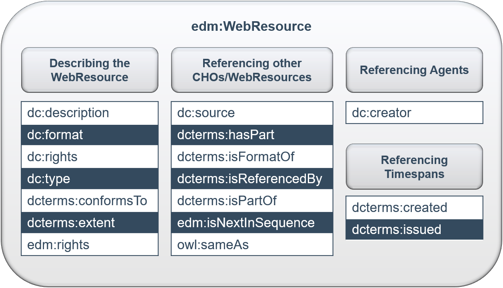

Properties | Value type | Cardinality | EDM Note | FIDDK Note
------------|------------|------------|------------|------------|
`dc:creator` | literal or reference to Agent | min 0, max unbounded | For the creator of the web resource. If possible supply the identifier of the creator from an authority source. Repeat for multiple creators. `<dc:creator xml:lang=“es”>Biblicoteca Nacional de España</dc:creatoror create a reference to an instance of the Agent class<dc:creator rdf:resource=“http://viaf.org/viaf/147143794/”/>` | Ersteller des Digitalisats; im FIDDK bisher nicht genutzt
`dc:description` | literal or reference | min 0, max unbounded | Use for an account or description of this digital representation   `<dc:description>Performance with Buccin trombone</dc:description>` | Beschreibung des Digitalisats; im FIDDK Anzeigetext des Links
`dc:format` | literal or reference | min 0, max unbounded | Use for the format of this digital representation. (Use the value “3D-­PDF” if appropriate.) `<dc:format>image/jpeg</dc:format>` | Format des Digitalisats als MIME Type. Bisher im FIDDK: `text/html`, `image/jpeg`, `image/png`, `application/pdf`
`dc:rights` | literal or reference | min 0, max unbounded | Use for the name of the rights holder of this digital representation if possible or for more general rights information. Note the difference between this property and the mandatory, controlled `edm:rights` property below.   `<dc:rights>Copyright © British Library Board</dc:rights>` | Für Rechteangaben der Datengeber_innen
`dc:source` | literal or reference | min 0, max unbounded | A related resource from which the Web resource is derived in whole or in part.   `<dc:source>The name of the source video tape</dc:source>` | Quelle; im FIDDK bisher nicht genutzt
`dc:type` | literal or reference to Concept | min 0, max unbounded | The nature or genre of the digital representation. Ideally the term(s) will be taken from a controlled vocabulary. `dc:type` should not be (strictly) identical to `edm:type`. `<dc:type>video</dc:type>` or create a reference to an instance of the Concept class `<dc:type rdf:about=“http://schema.org/VideoObject”>` | Art des Digitalisats; :warning: aktuell kein kontrolliertes Vokabular
`dcterms:conformsTo` | literal or reference | min 0, max unbounded | An established standard to which the web resource conforms. `<dcterms:conformsTo>W3C WCAG 2.0</dcterms:conformsTo>` (web content accessibility guidelines). | Standard des Digitalisats; im FIDDK bisher nicht vorgekommen
`dcterms:created` | literal or reference to Timespan | min 0, max unbounded | Date of creation of the Web resource. Europeana recommends date conforming to ISO 8601 starting with the year and with hyphens (YYYY-­MMDD).`<dcterms:created>2010</dcterms:created>` or create a reference to an instance of the TimeSpan class `<dc:date rdf:resource=“http://semium.org/time/2010”/>` | Datum der Erstellung des Digitalisats; als Datum formatiert
`dcterms:extent` | literal or reference | min 0, max unbounded | The size or duration of the digital resource. `<dcterms:extent>1h 26 min 41 sec</dcterms:extent>` | Maße / Größe / Dauer; im FIDDK wird dies bisher im `dcterms:extent` des ProvidedCHO angegeben
`dcterms:hasPart` |	reference to WebResource | min 0, max unbounded | A resource that is included either physically or logically in the web resource.  `<dcterms:hasPart rdf:resource=“http://www.identifier/Part”/>` | Für Relation zu hierarchisch untergeordneten Datensätzen; bisher nicht genutzt
`dcterms:isFormatOf` | literal or reference to WebResource | min 0, max unbounded | Another resource that is substantially the same as the web resource but in another format. `<dcterms:isFormatOf>http://upload.wikimedia.org/wikipedia/en/f/f3/Europeana_logo.png</dcterms:isFormatOf>` for a png image file of the described tiff web resource. Or as a link to a resource  `<dcterms:isFormatOf rdf:resource=“http://upload.wikimedia.org/wikipedia/en/f/f3/Europeana_logo.png”/>` | Für die Referenz weiterer Formate des selben digitalisierten Objekts; bisher im FIDDK nicht genutzt
`dcterms:isReferencedBy` | literal or reference to WebResource | min 0, max unbounded | A related resource that references, cites, or otherwise points to the described resource. In a IIIF implementation, dcterms:isReferencedBy can be used to connect a `edm:WebResource` to a IIIF manifest10URI. `<dcterms:isReferencedBy rdf:resource="http://dams.llgc.org.uk/iiif/2.0/1294670/manifest.json"/>` | Für andere Resourcen, die dieses Digitalisat referenzieren, z.B. auch IIIF Manifeste; bisher im FIDDK nicht genutzt
`dcterms:isPartOf` | reference to WebResource | min 0, max unbounded | A resource in which the WebResource is physically or logically included. This property can be used for web resources that are part of a hierarchy. Hierarchies can be represented as hierarchies of ProvidedCHOs or hierarchies of web resources but not both at the same time. See the Task Force report 9 on representing hierarchical entities. `<dcterms:isPartOf rdf:resource=“http://data.europeana.eu/item/08701/1B0BACAA44D5A807E43D9B411C9781AAD2F96E65”/>` | Für Relation zu hierarchisch übergeordneten Datensätzen; bisher im FIDDK nicht genutzt
`dcterms:issued` | literal or reference to Timespan | min 0, max unbounded | Date of formal issuance or publication of the web resource. Europeana recommends date conforming to ISO 8601 starting with the year and with hyphens (YYYY-MMDD). `<dcterms:issued>1999</dcterms:issued>` or create a reference to an instance of the TimeSpan class `<dcterms:issued rdf:resource=“http://semium.org/time/2010”/>` | Veröffentlichungsdatum des Digitalisats; formatiert als Datum; im FIDDK bisher nicht genutzt, da normalerweise nicht bekannt
`edm:isNextInSequence` | reference to WebResource | min 0, max unbounded | Where one CHO has several web resources, shown by multiple instances of the `edm:hasView` property on the `ore:Aggregation` this property can be used to show the sequence of the objects. Each web resource (apart from the first in the sequence) should use this property to give the URI of the preceding resource in the sequence. `<edm:isNextInSequence rdf:resource=“http://data.europeana.eu/item 2020601/9A3907CB46B651DE91621933ECC31EC1DC52B33C”/>` links to the web resource for page 2 of a digitised diary from the WebResource for page 3. | Für die Definition einer Reihenfolge von Digitalisaten (z.B. bei mehreren Seiten)
`edm:rights` | reference(URI) | min 0, max 1 | The value in this element will indicate the copyright, usage and access rights that apply to this digital representation. It is strongly recommended that a value is supplied for this property for each instance of a web resource. The rights statement specified at the level of the web resource will ‘override’ the statement specified at the level of the aggregation. The value in this element is a URI taken from the set of those defined for use in Europeana. A list of these can be found at https://pro.europeana.eu/available-­rights­‐statements. Note: rights statements must be exactly as specified there, which means in many cases that they must start with http and not https. `<edm:rights rdf:resource=“http://creativecommons.org/publicdomain/mark/1.0/”/>` `<edm:rights rdf:resource=“http://rightsstatements.org/vocab/InC/1.0/”/>`  Or create a reference to an instance of the cc:License class where additional details of the rights can beprovided (such as an expiry date for the restrictions): http://rightsstatements.org/vocab/NoC-­NC/1.0/ or `<edm:rights rdf:resource="#statement_3000095353971"/>` | Rechteangaben für Europeana entsprechend der "available-rights-statements"; aktuell im FIDDK nicht umsetzbar, da die Angaben der Datengeber_innen zu ungenau oder im Freitext sind
`owl:sameAs` | reference to WebResource | min 0, max unbounded | Provide the URI of another web representation of the same resource.  `<owl:sameAs rdf:resource=”urn:soundcloud:150424305”/>` | Link zu anderer Repräsentation desselben Digitalisats
~~`svcs:has_service`~~ | ~~reference~~ | ~~min 0, max unbounded~~ | - | -

#### Zusätzliche Webresource Properties im FIDDK
- keine

## EDM Contextual Classes
Die kontextuellen Klassen `edm:Agent`, `edm:Place`, `edm:Timespan`, `edm:Event` und `skos:Concept` beschreiben das *Wer?/Wo?/Wann?/Was?* eines `edm:ProvidedCHO`, sofern dies eindeutig in Form von Normdaten identifiziert werden kann und nicht nur als Literal angegeben ist.
- Sofern nicht anders angegeben, wird der Originaldefinition in EDM Note gefolgt.

### edm:Agent
In EDM wird `edm:Agent` für "[...] people, either individually or in groups [...]" genutzt. Im FIDDK wird `edm:Agent` nur genutzt, wenn nicht bekannt oder aus den vorliegenden Daten nicht ersichtlich ist, ob es sich um eine Person oder Körperschaft handelt. Für gewöhnlich ist dies aber bekannt, weshalb im FIDDK `edm:Agent` kaum eine Rolle spielt und stattdessen die "genaueren" `foaf:Person` und `foaf:Organization` genutzt werden.

#### foaf:Person
Hier auf Basis von `edm:Agent`, im Original EDM gibt es `foaf:Person` in der Form nicht, kann auf diese Weise aber wieder in das Original EDM zurückgeführt werden.

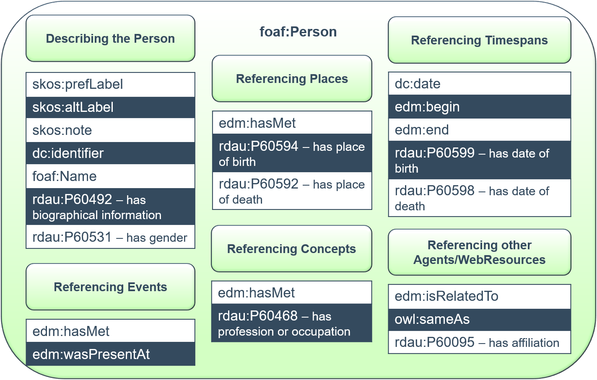

Properties | Value type | Cardinality | EDM Note | FIDDK Note
------------|------------|------------|------------|------------|
`skos:prefLabel` | literal | min 0, max 1 per lang tag | The preferred form of the name of the agent. Although the maximum number of occurrences is set at 1, it can be interpreted as 1 per language tag. At least one `skos:prefLabel` SHOULD be provided. Several prefLabels with languages tags are strongly recommended for language variants and translations. `<skos:prefLabel xml:lang="fr">Courtois neveu aîné</skos:prefLabel>`   `<skos:prefLabel xml:lang="en">Courtois’eldest nephew</skos:prefLabel>` | voller bevorzugter Name (nicht als "Nachname, Vorname"); Sprachtag sofern bekannt
`skos:altLabel` | literal | min 0, max unbounded | Alternative forms of the name of the agent. This is a *recommended* property for this class. `<skos:altLabel xml:lang="en">Courtois</skos:altLabel>` `<skos:altLabel xml:lang="fr">Augte. Courtois aîné</skos:altLabel>` | Namensvarianten; auch Pseudonyme; Art der Variante (Ehename, ...) aktuell nicht genauer spezifiziert; Sprachtag sofern bekannt
`skos:note` | literal | min 0, max unbounded | A note about the agent e.g. biographical notes. `<skos:note>Courtois neveu aîné started a company of the same name manufacturing brass instruments in Paris in 1803</skos:note>` | `rdau:P60492` (has biographical information) bevorzugt
`dc:date` | literal or reference to Timespan | min 0, max unbounded | A significant date associated with the Agent. Europeana recommends date conforming to ISO 8601 starting with the year and with hyphens (YYYY-MMDD). `<dc:date>1803</dc:date>` | Mit der Person assoziiertes Datum, das nicht Geburts- oder Sterbedatum ist, im FIDDK sehr selten. Formatierung als Datum (s.u.)
`dc:identifier`	| literal | min 0, max unbounded | An identifier of the agent. `<dc:identifier>http://viaf.org/viaf/96994048</dc:identifier>` | Weitere lokale Identifier
~~`edm:begin`~~	| ~~literal~~ | ~~min 0, max 1~~ | ~~The date the agent was born/established.Europeana recommends date conforming to ISO 8601 starting with the year and with hyphens (YYYY-­MMDD).`<edm:begin>1795</edm:begin>`~~ | Im FIDDK nicht benötigt, da `dateOfBirth` für Personen verwendet wird
~~`edm:end`~~ | ~~literal~~ | ~~min 0, max 1~~ | ~~The date the agent died/terminated.Europeana recommends date conforming to ISO 8601 starting with the year and with hyphens (YYYY-­MMDD).`<edm:end>1885</edm:end>`~~ | Im FIDDK nicht benötigt, da `dateOfDeath` für Personen verwendet wird
`edm:hasMet` | reference to Event/Concept/Place **or literal** | min 0, max unbounded | Reference to another entity which the agent has “met” in a broad sense. For example a reference to a Place class `<edm:hasMet rdf:resource=“http://sws.geonames.org/6620265/”>` | generische Beziehung zu Orten oder Konzepten, bisher im FIDDK nicht verwendet
`edm:isRelatedTo` | reference to Agent **or literal** | min 0, max unbounded | Reference to other entities, particularly other agents, with whom the agent is related in a generic sense. `<edm:isRelatedTo rdf:resource=“http://identifier/relatedAgent/”>` | Verweis zu anderen Personen oder Körperschaften, nicht notwendigerweise Verwandtschaftsbeziehungen im engeren Sinne
`edm:wasPresentAt` | reference to Event | min 0, max unbounded | - | Verweis zu einem Ereignis, an dem die Person beteiligt war (Art der Beteiligung hier nicht klar :arrow_right: andere Richtung von Ereignis zu Person bevorzugt)
~~`foaf:name`~~ | ~~literal~~ | ~~min 0, max unbounded~~ | ~~The name of the agent as a simple textual string. `<foaf:name>Auguste Courtois</foaf:name>`~~ | Stattdessen wird `skos:prefLabel` genutzt
~~`rdaGr2:biographicalInformation`~~ `rdau:P60492` | literal | min 0, max unbounded | Information pertaining to the life or history of the agent. ~~`<rdaGr2:biographicalInformation>Courtois neveu aîné started a company of the same name manufacturing brass instruments in Paris in 1803</rdaGr2:biographicalInformation>`~~ | Annex B folgend nach rdau (has biographical information) gemappt; biografische Angaben zur Person; Sprachtag sofern bekannt
~~`rdaGr2:dateOfBirth`~~ `rdau:P60599` | literal **or reference to Timespan** | min 0, max 1 | The date the agent (person) was born.Europeana recommends date conforming to ISO 8601 starting with the year and with hyphens (YYYY-­MMDD). This is a recommended property for this class. ~~`<rdaGr2:dateOfBirth>1795</rdaGr2:dateOfBirth>`~~ | Annex B folgend nach rdau (has date of birth) gemappt; Geburtsdatum als Datum formatiert (s.u.)
~~`rdaGr2:dateOfDeath`~~ `rdau:P60598` | literal **or reference to Timespan** | min 0, max 1 | The date the agent (person) died. Europeana recommends date conforming to ISO 8601 starting with the year and with hyphens (YYYY-­MMDD). This is a recommended property for this class. ~~`<rdaGr2:dateOfDeath>1895</rdaGr2:dateOfDeath>`~~ | Annex B folgend nach rdau gemappt (has date of death); Sterbedatum als Datum formatiert (s.u.)
~~`rdaGr2:placeOfBirth`~~ `rdau:P60594` | literal or reference to Place | min 0, max 1 | The town, city, province, state, and/or country in which a person was born. ~~`<rdaGr2:placeOfBirth>Lusaka, Northern Rhodesia</rdaGr2:placeOfBirth>`~~   ~~`<rdaGr2:placeOfBirth rdf:resource=”http://sws.geonames.org/909137/”/>`~~ | Annex B folgend nach rdau (has place of birth) gemappt; Geburtsort
~~`rdaGr2:placeOfDeath`~~ `rdau:P60592` | literal or reference to Place | min 0, max 1 | The town, city, province, state, and/or country in which a person died. ~~`<rdaGr2:placeOfDeath>London, United Kingdom</rdaGr2:placeOfDeath>`~~  ~~`<rdaGr2:placeOfDeath rdf:resource=“http://sws.geonames.org/2635167/”/>`~~ | Annex B folgend nach rdau (has place of birth) gemappt; Sterbeort
~~`rdaGr2:gender`~~  `rdau:P60531` | literal **or reference** | min 0, max 1 | The gender with which the agent identifies. ~~`<rdaGr2:gender>Female</rdaGr2:gender>`~~ | Annex B folgend nach rdau (has gender) gemappt; Geschlecht; statt literal wäre hier ein Vokabular schöner
~~`rdaGr2:professionOrOccupation`~~ `rdau:P60468` | literal or reference to Concept | min 0, max unbounded | The profession or occupation in which the agent works or has worked. ~~`<rdaGr2:professionOrOccupation>Instrument Maker</rdaGr2:professionOrOccupation>`~~ | Annex B folgend nach rdau (has profession or occupation) gemappt; Tätigkeit; folgt GND Schlagwörtern, die gegendert sind
`owl:sameAs` | reference to Agent (Person) | min 0, max unbounded | Another URI of the same agent. `<owl:sameAs rdf:resource=“http://www.identifier/sameResourceElsewhere”/>` | Link zur GND Person oder weiteren Dubletten

##### Zusätzliche Person Properties im FIDDK

Properties | Value type | Cardinality | FIDDK Note
------------|------------|------------|------------|
`rdau:P60095` | reference to Agent (Orga) | min 0, max unbounded | "has affiliation", Affiliation, Beziehung einer Person zu einer Organisation (Anstellung, Mitglied, ...)
`foaf:depiction` | reference | min 0, max 1 | Referenz zu einem Bild der Person

#### foaf:Organization
Hier auf Basis von `foaf:Organzation` der Object Templates, im Original EDM gibt es `foaf:Organzation` in der Form nicht, kann auf diese Weise aber wieder in das Original EDM zurückgeführt werden.

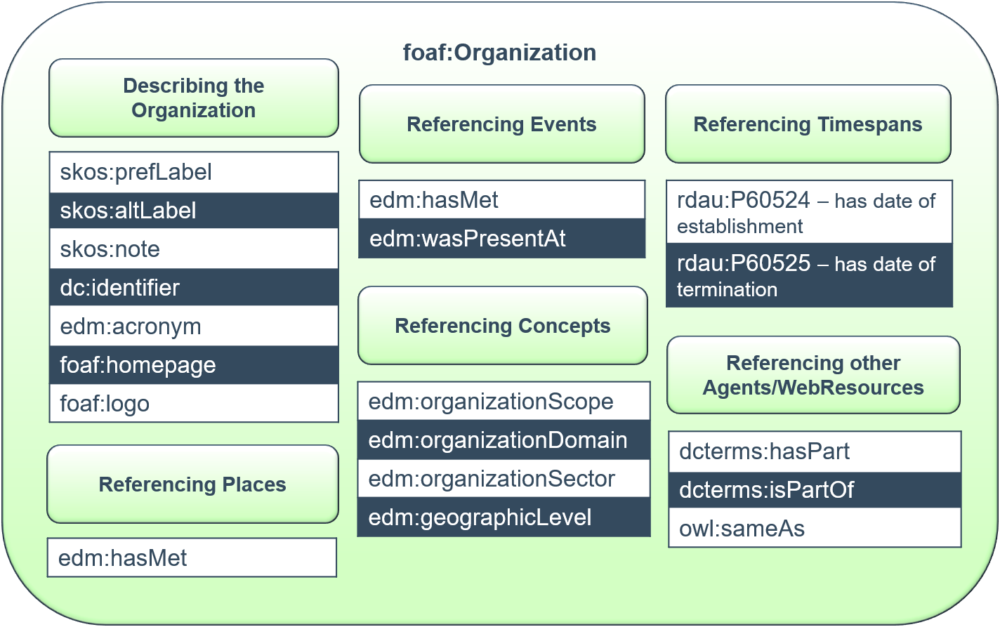

Properties | Value type | Cardinality | EDM Note | FIDDK Note
------------|------------|------------|------------|------------|
`skos:prefLabel` | literal | min 0, max 1 per lang tag | The preferred form of the name of the agent. Although the maximum number of occurrences is set at 1, it can be interpreted as 1 per language tag. At least one `skos:prefLabel` SHOULD be provided. Several prefLabels with languages tags are strongly recommended for language variants and translations. `<skos:prefLabel xml:lang="fr">Courtois neveu aîné</skos:prefLabel>`   `<skos:prefLabel xml:lang="en">Courtois’eldest nephew</skos:prefLabel>` | bevorzugter Name der Körperschaft; Sprachtag sofern bekannt
`skos:altLabel` | literal | min 0, max unbounded | Alternative forms of the name of the agent. This is a *recommended* property for this class. `<skos:altLabel xml:lang="en">Courtois</skos:altLabel>` `<skos:altLabel xml:lang="fr">Augte. Courtois aîné</skos:altLabel>` | Namensvarianten; Sprachtag sofern bekannt
`skos:note` | literal | min 0, max unbounded | A note about the agent e.g. biographical notes. `<skos:note>Courtois neveu aîné started a company of the same name manufacturing brass instruments in Paris in 1803</skos:note>` | Beschreibung der Körperschaft
`dc:identifier`	| literal | min 0, max unbounded | An identifier of the agent. `<dc:identifier>http://viaf.org/viaf/96994048</dc:identifier>` | Weitere lokale Identifier
~~`rdaGr2:dateOfEstablishment`~~ `rdau:P60524` | literal **or reference to Timespan** | min 0, max 1 | The date on which the agent (corporate body) was established or founded. ~~`<rdaGr2:dateOfEstablishment>1795</rdaGr2:dateOfEstablishment>`~~ | Annex B folgend nach rdau (has date of establishment) gemappt; Datum der Gründung der Körperschaft (Beginn)
~~`rdaGr2:dateOfTermination`~~ `rdau:P60525` | literal **or reference to Timespan** | min 0, max 1 | The dateon which the agent (corporate body) was terminated or dissolved. ~~`<rdaGr2:dateOfTermination>1895</rdaGr2:dateOfTermination>`~~ | Annex B folgend nach rdau (has date of termination) gemappt; Datum der Auflösung der Körperschaft (Ende)
~~`edm:acronym`~~ |	~~literal~~ | ~~min 0, max 1 (Mandatory for organization, optional for persons)~~ | The acronym (or abbreviated form of an organization’s name) that is commonlyused to identify an organization | Akronym der Körperschaft; bisher im FIDDK nicht genutzt, Tendenz zur Modellierung als `skos:altLabel`
`edm:organizationScope` |	literal or reference to Concept | min **0**, max **unbounded** | The scope of work of the organization in terms of inclusivity of cultural heritage sectors. The value in this element is taken from a controlled list maintained by Europeana: `Other/None`, `Cross`, `Single`, `Thematic`, `Individual` | Bisher im FIDDK nicht genutzt, wenn dann nicht mandatory
`edm:organizationDomain` | literal or reference to Concept | min **0**, max **unbounded** | The general activity or sector in which an organization operates. The value in this element is taken from a controlled list maintained by Europeana: `Gallery`, `Library`, `Archive`, `Museum`, `Audio visual/Sound Archive`, `Publisher`, `Research (e.g.university)`, `Education (e.g.primary and secondary school)`, `Creative Industry (e.g. media sector, game developer)`, `Cross domain`, `Performing Arts`, `Proposal Writer/Consultant/Other(sic)` | Domain der Körperschaft, nicht mandatory; Nutzung der GND Schlagwörter statt der Liste aus Europeana
`edm:organizationSector` | literal or reference to Concept | min **0**, max 1 | The general activity or sector in which an organization operates. The value in this element is taken from a controlled list maintained by Europeana in the CRM: `Government Department/Ministry`, `Private`, `Public` | Bisher im FIDDK nicht genutzt, wenn dann nicht mandatory
`edm:geographicLevel` |	literal or reference to Concept | min **0**, max 1 | The scope of work of the organization in terms of geographic level. The value in this element is taken from a controlled list maintained by Europeana in the CRM. `Regional`, `National`, `European`, `Worldwide` | Bisher im FIDDK nicht genutzt, wenn dann nicht mandatory
~~`edm:language`~~ | ~~literal or reference~~ | ~~min 1, max 1~~ | - | Europeana spezifisch
~~`edm:country`~~ |	~~literal or reference to Place ~~ | ~~min 1, max 1~~ | ~~The country value assigned to an organization by Europeana as given in edm:country~~ | Europeana spezifisch
~~`edm:europeanaRole`~~ |	~~literal or reference to Concept~~ | ~~min 1, max 1~~ | ~~To indicate the role and relationship of an organization toEuropeana.~~ | Europeana spezifisch
`foaf:homepage` |	reference | min 0, max 1 | The URL for the home page of the organization | Homepage der Körperschaft
`foaf:logo` |	reference | min 0, max 1 | - | Logo der Körperschaft
`edm:wasPresentAt` | reference to Event | min 0, max unbounded | - | Verweis zu einem Ereignis, an dem die Körperschaft beteiligt war (Art der Beteiligung hier nicht klar :arrow_right: andere Richtung von Ereignis zu Körperschaft bevorzugt)
`dcterms:hasPart` |	reference to Agent	| min 0, max unbounded | Reference to an Agent that is part of the Agent being described (e.g. a part of a corporation). `<dcterms:hasPart rdf:resource=“http://identifier/partOfCorporation/”>` | Verweis auf untergeordnete Körperschaften
`dcterms:isPartOf` | reference to Agent | min 0, max unbounded | Reference to an agent that the described agent is part of. `<dcterms:isPartOf rdf:resource=“http://identifier/parentCorporation/”>` | Verweis auf übergeordnete Körperschaften
`owl:sameAs` | reference to Agent (Orga) | min 0, max unbounded | - | Link zu GND oder anderen Dubletten

##### Zusätzliche Organization Properties im FIDDK
Properties | Value type | Cardinality | FIDDK Note
------------|------------|------------|------------|
`edm:isNextInSequence` | reference to Agent (Orga) | min 0, max unbounded | Für die Abbildung von Vorgänger/Nachfolger Körperschaften (zeitlich)
`foaf:depiction` | reference | min 0, max 1 | Referenz zu einem Bild der Körperschaft

### edm:Place
Ein Ort kann im FIDDK auch ein Theatergebäude sein (im Unterschied zur Institution des Theaters als Körperschaften).

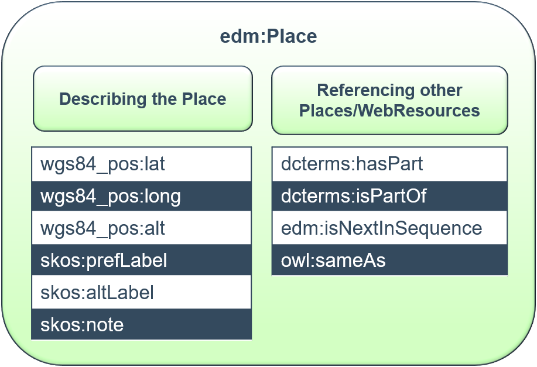

Properties | Value type | Cardinality | EDM Note | FIDDK Note
------------|------------|------------|------------|------------|
`wgs84_pos:lat` |	floating point | min 0, max 1 | The latitude of a spatial thing (decimal degrees). This is a recommended property for this class. `<wgs84_pos:lat>51.5075</wgs84_pos:lat>` | Latitude Koordinate als Floating Point
`wgs84_pos:long` | floating point | min 0, max 1 | The longitude of a spatial thing (decimal degrees). This is a recommended property for this class. `<wgs84_pos:long>­‐0.1231</wgs84_pos:long>` | Longitude Koordinate als Floating Point
~~`wgs84_pos:alt`~~ |	~~floating point~~ | ~~min 0, max 1~~ | ~~The altitude of a spatial thing (decimal metres above the reference) `<wgs84_pos:alt>21</wgs84_pos:alt>`~~ | Höhe in Metern, im FIDDK eher nicht relevant
~~`wgs84_pos:lat_long`~~ | ~~literal~~ | ~~min 0, max 1~~ | - | Kann aus lat und long generiert werden
`skos:prefLabel` | literal | min 0, max 1 per lang tag | The preferred form of the name of the place. Although the maximum number of occurrences is set at 1, it can be interpreted as 1 per language tag. At least one `skos:prefLabel` SHOULD be provided. Several prefLabels with languages tags are strongly recommended for language variants and translations.  `<skos:prefLabel xml:lang="en">London</skos:prefLabel>` | Bevorzugter Name für den Ort; Sprachtag sofern bekannt
`skos:altLabel` | literal | min 0, max unbounded | Alternative forms of the name of the place.   `<skos:altLabel xml:lang="en">Greater London</skos:altLabel>` | Alternativer Name für den Ort; Sprachtag sofern bekannt
`skos:note` | literal | min 0, max unbounded | Information relating to the place.   `<skos:note xml:lang="en">Pop. 21m</skos:note>` | Beschreibung für den Ort; Sprachtag sofern bekannt
`dcterms:hasPart` |	reference to Place | min 0, max unbounded | Reference to a place that is part of the place being described.   `<dcterms:hasPart rdf:resource=“http://sws.geonames.org/2643741/”/>` (City of London) | Ort hat untergeordnete Einheiten (Land :arrow_right: Stadt :arrow_right: Theater)
`dcterms:isPartOf` | reference to Place | min 0, max unbounded | Reference to a place that the described place is part of.   `<dcterms:isPartOf rdf:resource=“http://sws.geonames.org/2635167/”/>` (United Kingdom) | Ort ist Teil eines anderen Ortes oder Theater ist in einer Stadt
`edm:isNextInSequence` | reference to Place | min 0, max unbounded | Can be used to represent a sequence of Place entities over time e.g. the historical layers of the city of Troy. Use this for objects that are part of a hierarchy or sequence to ensure correct display in the portal. | Für die Abbildung historischer Orte
`owl:sameAs` | reference to Place | min 0, max unbounded | URI of a Place   `<owl:sameAs rdf:resource=“http://sws.geonames.org/2635167/”/>`(London) | Link zu GND Geografikum oder anderen Dubletten

#### Zusätzliche Place Properties im FIDDK
- keine

### edm:Timespan
`edm:Timespan` wird im FIDDK aktuell nicht genutzt, da Informationen über Epochen bei den Datengeber_innen bisher nicht vorliegen. In der GND werden Angaben zu Epochen als Untergruppe von Schlagwort abgebildet ("Historisches Einzelereignis oder Epoche"). Daher werden im FIDDK vorkommende GNDs dieser Kategorie ebenfalls innerhalb von `skos:Concept` abgebildet.

~~Properties~~ | ~~Value type~~ | ~~Cardinality~~ | ~~EDM Note~~
------------|------------|------------|------------|
~~`skos:prefLabel`~~ | ~~literal~~ | ~~min 0, max 1 per lang tag~~ | ~~The preferred form of the name of the timespan or period. Although the maximum number of occurrences is set at 1, it can be interpreted as 1 per language tag. At least one skos:prefLabel SHOULD be provided.Several prefLabels with languages tags are strongly recommended for language variants and translations.`<skos:prefLabel xml:lang=“en”>Roman Empire</skos:prefLabel>`~~
~~`skos:altLabel`~~ | ~~literal~~ | ~~min 0, max unbounded~~ | ~~Alternative forms of the name of the timespan or period. `<skos:altLabel xml:lang=“fr”>Empire romain (27 avant J.­‐C.-‐476 après J.-­C.)</skos:altLabel>`~~
~~`skos:note`~~ | ~~literal~~ | ~~min 0, max unbounded~~ | ~~Information relating to the timespan or period.`<skos:note>The Roman Empire(Latin: Imperium Romanum) was the post­‐Republican period of the ancient Roman civilization, characterised by an autocraticform of government and large territorial holdings around the Mediterraneanin Europe, Africa, and Asia.</skos:note>`~~
~~`dcterms:hasPart`~~ |	~~reference to Timespan~~ | ~~min 0, max unbounded~~ | ~~Reference to a timespan which is part of the described timespan.~~
~~`dcterms:isPartOf`~~	| ~~reference to Timespan~~ | ~~min 0, max unbounded~~ | ~~Reference to a timespan of which the described timespan is a part.~~
~~`edm:begin`~~ | ~~literal~~	| ~~min 0, max 1~~ | ~~The date the timespan started. Europeana recommends date conforming to ISO 8601 starting with the year and with hyphens (YYYY-­MMDD). Providing edm:begin in combination with edm:end is recommended for this class.`<edm:begin>27 BC</edm:begin>`~~
~~`edm:end`~~ | ~~literal~~	| ~~min 0, max 1~~| ~~The date the timespan finished.Europeana recommends date conforming to ISO 8601 starting with the year and with hyphens (YYYY-­MMDD). Providing edm:end in combination with edm:begin is recommended for this class.`<edm:end>476 AD</edm:end>`~~
~~`edm:isNextInSequence`~~ | ~~reference to Timespan~~ | ~~min 0, max unbounded~~ | ~~Can be used to represent a sequence of Time periods. Use this for objects that are part of a hierarchy or sequence to ensure correct display in the portal.`<edm:isNextInSequence rdf:resource=“http://semium.org/time/roman_republic”/>` (The Roman Empire was preceded by the Roman Republic)~~
~~`crm:P79_beginning_is_qualified_by`~~ | ~~literal~~ | ~~min 0, max unbounded~~ |
~~`crm:P80_end_is_qualified_by`~~ | ~~literal~~ | ~~min 0, max unbounded~~ |
~~`owl:sameAs`~~ | ~~reference to Timespan~~ | ~~min 0, max unbounded~~ | ~~The URI of a timespan`<owl:sameAs rdf:resource=“http://semium.org/time/roman_empire”/>`~~

### skos:Concept
Der FIDDK stützt sich bei Konzepten vor allem auf Sachbegriffe der GND und deren Relationen. Konzepte im FIDDK können auch Epochenangaben sein.

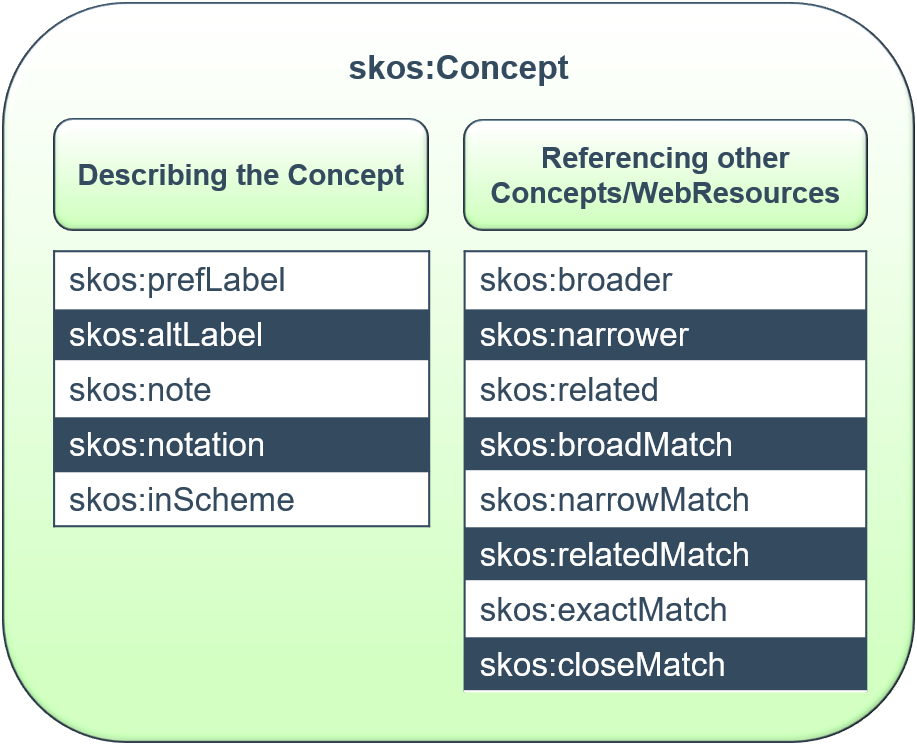

Properties | Value type | Cardinality | EDM Note | FIDDK Note
------------|------------|------------|------------|------------|
`skos:prefLabel` | literal | min 0, max 1 per lang tag | The preferred form of the name of the concept. Although the maximum number of occurrences is set at 1, it can be interpreted as 1 per language tag. At least one `skos:prefLabel` SHOULD be provided.Several prefLabels with languages tags are strongly recommended for language variants and translations.   `<skos:prefLabel xml:lang="fr">Buccin</skos:prefLabel>` `<skos:prefLabel xml:lang="de">Buccin</skos:prefLabel>` `<skos:prefLabel xml:lang="nl">Buccin</skos:prefLabel>` | Bevorzugter Name des Konzepts; Sprachtag sofern bekannt
`skos:altLabel` | literal | min 0, max unbounded | Alternative forms of the name of the concept. Recommended unless several prefLabel are already given with different language tags (altLabel is not suitable for translations of prefLabel).  `<skos:altLabel xml:lang="en">Buccin</skos:altLabel>` | Alternativer Name des Konzepts; Sprachtag sofern bekannt
`skos:broader` | reference to Concept | min 0, max unbounded | The identifier of a broader concept in the same thesaurus or controlled vocabulary.  `<skos:broader rdf:resource=“http://www.mimo-db.eu/InstrumentsKeywords/4369_1”/>` | Verweis auf weiteres/übergeordnetes Konzept, bisher im FIDDK nicht genutzt
`skos:narrower` |	reference to Concept | min 0, max unbounded | The identifier of a narrower concept.  `<skos:narrower rdf:resource=“http://narrower.term/”/>` | Verweis auf engeres/untergeordnetes Konzept, bisher im FIDDK nicht genutzt
`skos:related` | reference to Concept | min 0, max unbounded | The identifier of a related concept.  `<skos:related rdf:resource=“http://related.term/”/>` | Verweise auf verwandtes Konzept, bisher im FIDDK nicht genutzt
~~`skos:broadMatch`, `skos:narrowMatch`, `skos:relatedMatch`~~ | ~~reference to Concept~~ | ~~min 0, max unbounded~~ | ~~The identifier of a broader, narrower or related matching concepts from other concept schemes. `skos:broadMatch rdf:resource=“http://broadMatch.term/”/>` `<skos:narrowMatch rdf:resource=“http://narrowMatch.term/”/>` `<skos:relatedMatch rdf:resource=“http://relatedMatch.term/”/>`~~ | Verweis auf andere vergleichbare Konzepte aus anderen Ontologien, bisher im FIDDK nicht genutzt, wahrscheinlich auch nicht in naher Zukunft
~~`skos:exactMatch`, `skos:closeMatch`~~ | ~~reference to Concept~~ | ~~min 0, max unbounded~~ | ~~The identifier of close or exactly matching concepts from other concept schemes.  `<skos:exactMatch rdf:resource=“http://exactMatch.term/”/>` `<skos:closeMatch rdf:resource=“http://closeMatch.term/”/>`~~ | Verweis auf andere vergleichbare Konzepte aus anderen Ontologien, bisher im FIDDK nicht genutzt, wahrscheinlich auch nicht in naher Zukunft
`skos:note` | literal | min 0, max unbounded | Information relating to the concept.  `<skos:note>The buccin is avisually distinctive trombone popularized in military bands in France between 1810–1845 which subsequently faded into obscurity.</skos:note>` | Beschreibungen/Erklärungen zum Konzept; Sprachtag sofern bekannt
`skos:notation` |	string (+ rdf:datatype attribute) | min 0, max unbounded | The notation in which the concept is represented. This may not be words in natural language for some knowledge organisation systems e.g. algebra `<skos:notation rdf:datatype=“http://www.w3.org/2001/XMLSchema#int”>123</skos:notation>` | Notation des Konzepts, bisher im FIDDK nicht genutzt
~~`skos:inScheme` (URI should resolve to something meaningful)~~ | ~~reference to ConceptScheme~~ | ~~min 0, max unbounded~~ | ~~The URI of a concept scheme~~ | bisher keine Konzept Schemata im FIDDK

#### Zusätzliche Concept Properties im FIDDK
- keine

### edm:Event
Events basieren entweder auf der GND (Konferenz oder Ereignis bzw. Konferenz-/Ereignisfolge) oder auf strukturierten oder Freitextangaben der Datengeber_innen.

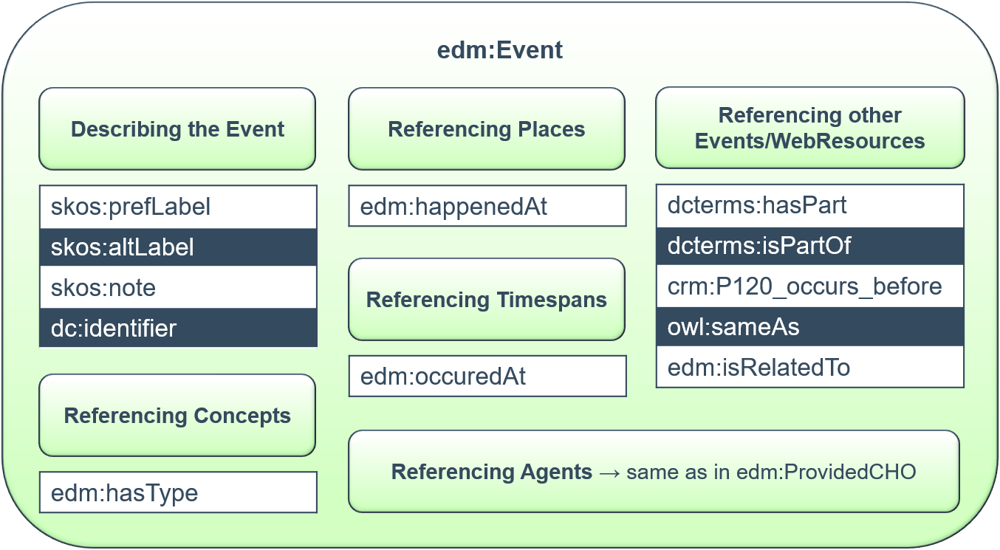

Properties | Value type | Cardinality | EDM Note | FIDDK Note
------------|------------|------------|------------|------------|
`edm:happenedAt` | reference to Place **or literal** | min 0, max unbounded | - | Ereignisort
`edm:occuredAt` |	reference to TimeSpan **or literal** | min 0, max unbounded | - | Datum des Ereignisses
`owl:sameAs` | reference to Event | min 0, max unbounded | - | Link zu GND Ereignis oder Dubletten
`skos:prefLabel` | literal | min 0, max 1 per lang tag | - | Bevorzugter Ereignisname; Sprachtag sofern bekannt
`skos:altLabel` | literal	| min 0, max unbounded | - | Alternativer Ereignisname; Sprachtag sofern bekannt
`skos:note` | literal	| min 0, max unbounded | - | Beschreibungstext zum Event; Sprachtag sofern bekannt
`dc:identifier` | literal | min 0, max unbounded | - | Andere lokale IDs für diese Entität
`dcterms:hasPart` |	reference to Event **or literal** | min 0, max unbounded | - | Verweis auf untergeordnetes Ereignis. Interessant für Festivals oder Reihen von Aufführungen, kam bisher noch nicht vor
`dcterms:isPartOf` | reference to Event **or literal** | min 0, max unbounded | - | Verweis auf übergeordnetes Ereignis. Interessant für Festivals oder Reihen von Aufführungen, kam bisher noch nicht vor
~~`crm:P120_occurs_before`~~ | ~~reference to Event~~ | ~~min 0, max unbounded~~ | - | Bedarf auszudrücken, dass ein Ereignis zeitlich vor einem anderen Ereignis stattgefunden hat, kam aktuell noch nicht vor. Abgesehen davon kann dies durch `edm:occuredAt` herausgefunden werden.
`edm:hasType` |	literal or reference to Concept | min 0, max unbounded | - | Art des Ereignises (Premiere, ...) :arrow_right: Basierend auf GND Sachbegriffen (:warning:noch kein fertiges Vokabular)
`edm:isRelatedTo` |	reference	to Event **or literal** | min 0, max unbounded | - | Verweis auf vergleichbare / in Beziehung stehende Ereignisse

#### Zusätzliche Event Properties im FIDDK
- alle Tätigkeitsproperties, die auch zu `edm:ProvidedCHO` hinzugefügt wurden (s.o.)
- sowie:

Properties | Value type | Cardinality | FIDDK Note
------------|------------|------------|------------|
`foaf:depiction` | reference | min 0, max 1 | Referenz zu einem Bild des Ereignisses
`foaf:homepage` |	reference | min 0, max 1 | Homepage zum Ereignis

## Statistik
Welche Properties werden tatsächlich in welcher Anzahl genutzt?
TODO

## Identifier
- Jede Resource muss einen eigenen Unique Resource Identifier (URI) haben, um sie miteinander verlinkbar zu machen.
- Der Identifier ist in `@rdf:about` der jeweiligen Resource angegeben und bei einem Link von einer Resource zu einer anderen wird `@rdf:resource` verwendet.
- Die Identifier basieren auf den Identifiern der Datengeber_innen, um diesen die Möglichkeit zu geben, die eigenen Daten leicht zu finden.
- Identifier von Normdaten basieren auf der GND und potentiell auch auf anderen Normdatenanbietern wie Geonames oder VIAF. Falls es Normdaten eines bestimmten Datengebers sind, die noch nicht als GND o.ä. vorliegen, dann basieren die Identifier auf den lokalen IDs der Datengeber_innen.
- Nicht alle Links sind aktuell tatsächlich abrufbar, sondern nur `Record`, `agent` und `event`

### Format
- ProvidedCHO: `http-Adresse/Typ/DataProviderKürzel_LokalerIdentifier`
- Normdaten: `http-Adresse/Typ/NormdatenKürzel_Identifier`
- WebResource: wie angegeben

Class | Type | Example Properties | Example Link | Note
-----|-----|-----|-----|-----
`ore:Aggregation` | *aggregation* | nur in `@rdf:about` in `ore:Aggregation`| http://performing-arts.eu/aggregation/TMD_415180 | :warning: Link aktuell nicht weitergeleitet/funktionsfähig
`edm:ProvidedCHO` | *Record* | `edm:aggregatedCHO` in `ore:Aggregation`, `dcterms:isPartOf` in `edm:ProvidedCHO`, ... | http://performing-arts.eu/Record/TMD_415180 | "Record" statt "item" wie in EDM, da dies in VuFind Standard ist und sonst zu viel hätte angepasst werden müssen
`foaf:Person` `foaf:Organization` | *agent* | `dc:creator` in `edm:ProvidedCHO`, `edm:dataProvider` in `ore:Aggregation`, ... | http://performing-arts.eu/agent/gnd_18273643 oder http://performing-arts.eu/agent/TMD_1234 | bei den Links kein Unterschied zwischen Personen und Körperschaften
`edm:Event` | *event* | `edm:wasPresentAt` in `edm:ProvidedCHO` oder `foaf:Person` | http://performing-arts.eu/event/gnd_1001775-6 oder http://performing-arts.eu/event/TMD_1234 |
`edm:Place` | *place* | `edm:happenedAt` in `edm:Event` oder `dcterms:spatial` in `edm:ProvidedCHO` | http://performing-arts.eu/place/gnd_1234 oder http://performing-arts.eu/place/TMD_1234 | :warning: Link aktuell nicht weitergeleitet/funktionsfähig
`skos:Concept` | *concept* | `dc:subject` in `edm:ProvidedCHO` | http://performing-arts.eu/concept/gnd_1234 oder http://performing-arts.eu/concept/TMD_1234 | :warning: Link aktuell nicht weitergeleitet/funktionsfähig

## Datumsformatierung
Im FIDDK werden alle Datumsangaben als Zeitspanne angegeben (auch wenn es nur ein Tag ist :arrow_right: dann als Zeitspanne von 00:00:00 bis 23:59:59). Das Datumsformat ist dabei ein Subset von ISO-8601 entsprechend der in [Solr verwendeten Datumsformatierung](https://lucene.apache.org/solr/guide/8_6/working-with-dates.html). Bei Daten vor Christus (BC) wird ein `-` vorangestellt. Bei uneingeschränkten Daten, z.B. bei Zeitschriften ("seit 1987","1987-","bis 1987","-1987") wird ein `*` benutzt. Völlig unklare Werte wie "früher" werden nicht abgebildet. Für die Modellierung unsicherer Angaben wie "Sommer 2002" oder "ca. 1998" siehe [Modellierung von Unsicherheit](#modellierung-von-unsicherheit).

`YYYY-MM-DDThh:mm:ssZ_YYYY-MM-DDThh:mm:ssZ`

### Beispiele
- `2020-06-21T00:00:00Z_2020-06-21T23:59:59Z` (21. Juni 2020)
- `1810-01-01T00:00:00Z_1810-12-31T23:59:59Z` (Jahr 1810)
- `1623-01-01T00:00:00Z_1627-12-31T23:59:59Z` (1623-1627)
- `1994-01-01T00:00:00Z_*` (1994-)
- `-0009-01-01T00:00:00Z_-0009-12-31T23:59:59Z` (Jahr 10 v.Chr. (Jahr 0 wird als Jahr 1 v.Chr. betrachtet))

## Modellierung von Unsicherheit
Im FIDDK werden Unsicherheiten durch das Attribut `@rdfs:label` abgebildet, das an Orts- oder Datumsangaben angehängt werden kann, sofern diese Unsicherheiten enthalten. Unsicherheiten können Angaben in eckigen Klammern [] und/oder mit Fragezeichen sein sowie beispielsweise unsichere Angaben bei Datumsangaben mit "ca./vor/um/nach...". 
Die Werte in `@rdfs:label` entsprechen der im Original als Literal angegebenen Unsicherheit, sodass diese 1:1 im FID Portal angezeigt werden kann. Neben diesem Attribut wird in `@rdf:resource` eine standardisierste Version angeboten, wenn möglich.  
Dies folgt keinem Standard, sondern ist ein Versuch die Unsicherheiten, die in den Ursprungsdaten vorhanden sind, abzubilden.

### Beispiele
- `<dcterms:issued rdf:resource="1810-01-01T00:00:00Z_1810-12-31T23:59:59Z" rdfs:label="ca. 1810">`
- `<edm:happenedAt rdf:resource="http://www.performing-arts.eu/place/gnd_4023118-5" rdfs:label="[Hamburg?]">`

## XML Schema
XML Schema des FIDDK basiert auf [EDM XML Schema](https://github.com/europeana/corelib/tree/develop/corelib-edm-definitions/src/main/resources/eu)

**TODO**

## Beispieldatensätze

**TODO**

## Aktuell ungelöste Probleme
- Bühnenbildner (nicht in rdau vorhanden)
- ~~Signatur~~
- Darstellung von Produktionen / Inszenierungen (aktuell als abstraktes `edm:ProvidedCHO`)
- Darstellung von Werken (aktuell als abstraktes `edm:ProvidedCHO`)
- Festivals (aktuell als `edm:Event` mit `dc:type` Festival und untergeordneten Ereignissen mit `dcterms:hasPart`)
- Vokabular für Ereignistyp
- Vokabular Gender
- ~~Anzeige im Portal für Tätigkeiten (allgemeiner Begriff (Regie) oder gegendert (Regisseur_in))?~~
- Unterscheidung Herausgeber_in / Redakteur_in (im Englischen ist beides "editor"), aktuelle Lösung ist evtl nicht ganz korrekt
