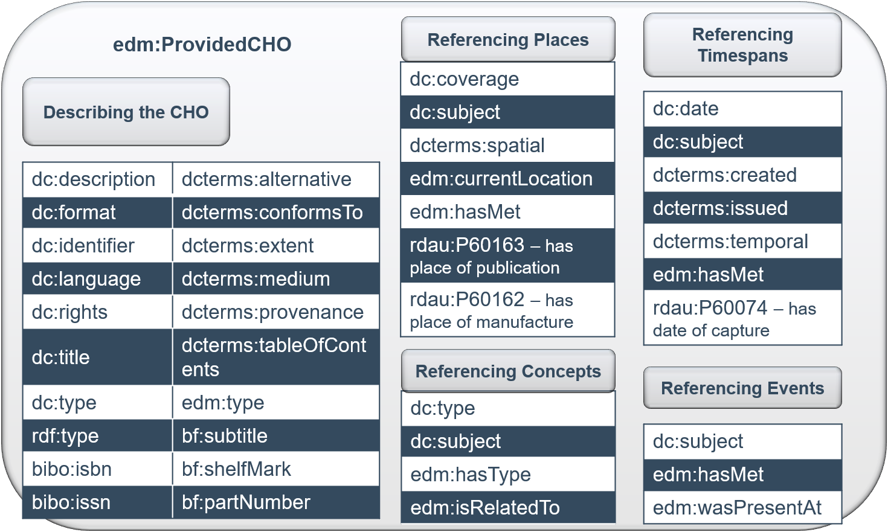
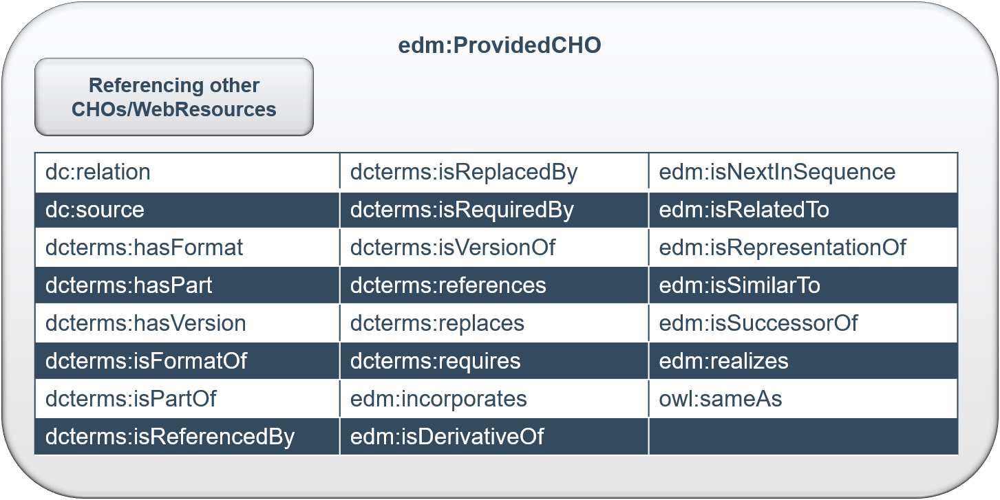
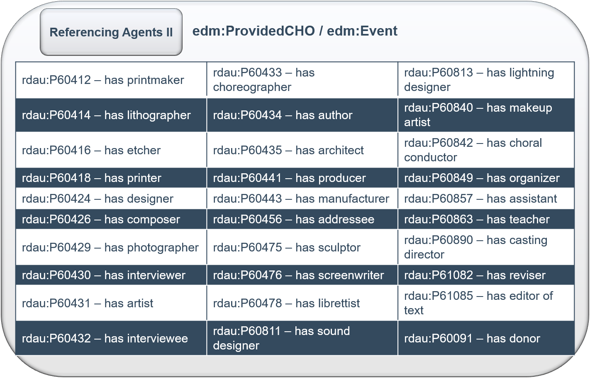
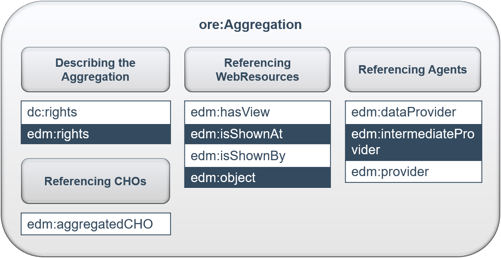
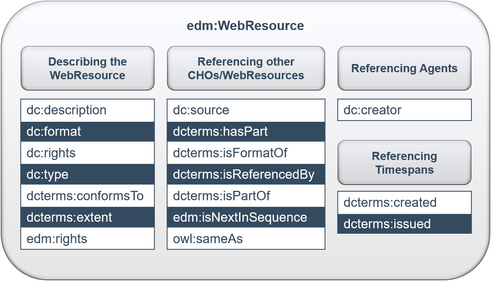
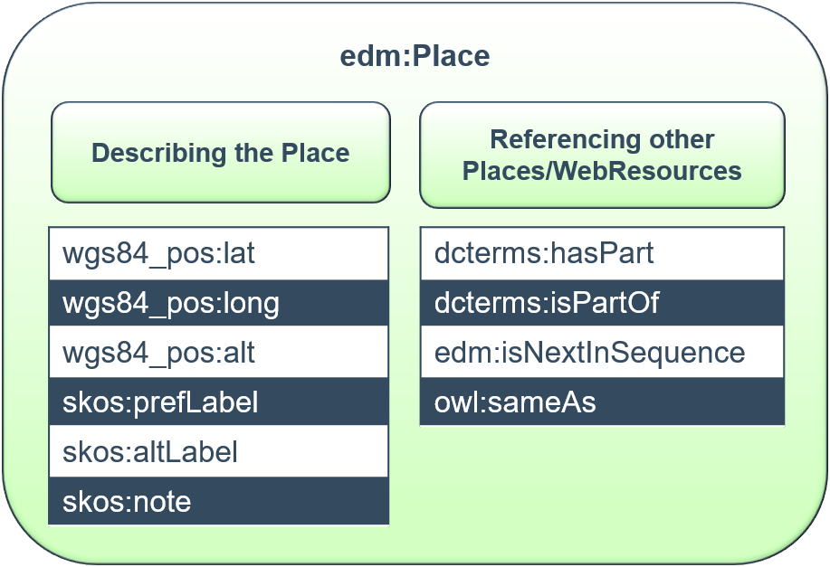
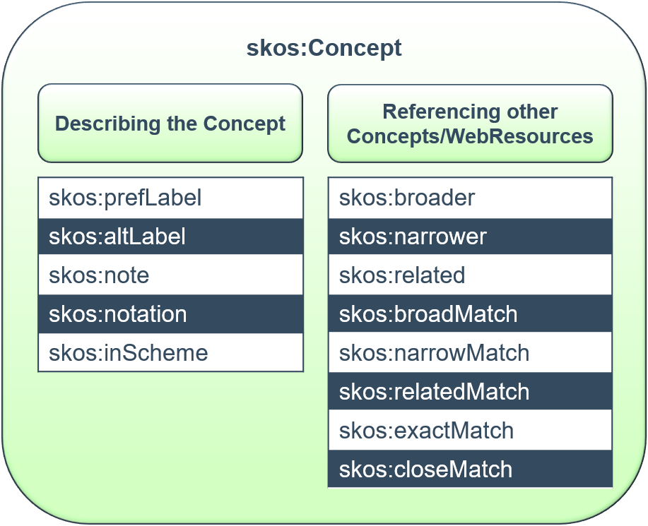

# Datenmodell FID DK - Application Profile EDM

<!-- TOC depthFrom:1 depthTo:6 withLinks:1 updateOnSave:1 orderedList:0 -->

- [Datenmodell FID DK - Application Profile EDM](#datenmodell-fid-dk-application-profile-edm)
	- [Allgemeines](#allgemeines)
	- [Namespaces](#namespaces)
		- [Zusätzliche Namespaces im FIDDK](#zusätzliche-namespaces-im-fiddk)
	- [EDM Core Classes](#edm-core-classes)
		- [edm:ProvidedCHO](#edmprovidedcho)
			- [Zusätzliche ProvidedCHO Properties im FIDDK](#zusätzliche-providedcho-properties-im-fiddk)
		- [ore:Aggregation](#oreaggregation)
			- [Zusätzliche Aggregation Properties im FIDDK](#zusätzliche-aggregation-properties-im-fiddk)
		- [edm:WebResource](#edmwebresource)
			- [Zusätzliche Webresource Properties im FIDDK](#zusätzliche-webresource-properties-im-fiddk)
	- [EDM Contextual Classes](#edm-contextual-classes)
		- [edm:Agent](#edmagent)
			- [foaf:Person](#foafperson)
				- [Zusätzliche Person Properties im FIDDK](#zusätzliche-person-properties-im-fiddk)
			- [foaf:Organization](#foaforganization)
				- [Zusätzliche Organization Properties im FIDDK](#zusätzliche-organization-properties-im-fiddk)
		- [edm:Place](#edmplace)
			- [Zusätzliche Place Properties im FIDDK](#zusätzliche-place-properties-im-fiddk)
		- [edm:Timespan](#edmtimespan)
		- [skos:Concept](#skosconcept)
			- [Zusätzliche Concept Properties im FIDDK](#zusätzliche-concept-properties-im-fiddk)
		- [edm:Event](#edmevent)
			- [Zusätzliche Event Properties im FIDDK](#zusätzliche-event-properties-im-fiddk)
	- [Statistik](#statistik)
	- [Identifier](#identifier)
		- [Format](#format)
	- [Datumsformatierung](#datumsformatierung)
		- [Beispiele](#beispiele)
	- [Modellierung von Unsicherheit](#modellierung-von-unsicherheit)
	- [XML Schema](#xml-schema)
	- [Beispieldatensätze](#beispieldatensätze)
	- [Aktuell ungelöste Probleme](#aktuell-ungelöste-probleme)

<!-- /TOC -->

**Version:** 1.0  
**Autor_in:** Julia Beck, Universitätsbibliothek Johann Christian Senckenberg Frankfurt am Main

## Allgemeines
- Nachnutzung des Metadatenstandards [EDM (Europeana Data Model)](https://pro.europeana.eu/page/edm-documentation) + universell (GLAM) + erweiterbar + flexibel + RDF basiert
- dieses Application Profile basiert auf der Originaldokumentation von [EDM](https://pro.europeana.eu/page/edm-documentation) entsprechend der [Mapping Guidelines](https://pro.europeana.eu/files/Europeana_Professional/Share_your_data/Technical_requirements/EDM_Documentation/EDM_Mapping_Guidelines_v2.4_102017.pdf), der [EDM Object Templates](https://github.com/europeana/corelib/wiki/EDMObjectTemplatesProviders) und des [EDM XML Schema](https://github.com/europeana/corelib/tree/develop/corelib-edm-definitions/src/main/resources/eu)
- die Daten liegen im FIDDK als `RDF/XML` vor
- im Folgenden eine Übersicht über EDM, seine Klassen und Properties sowie
Hinweise zu den Änderungen im FID DK (Application Profile, Änderungen sind **fett** markiert bzw ~~durchgestrichen~~)
- Nicht alles, das nicht durchgestrichen ist, wird auch tatsächlich genutzt. Teilweise wurde es nur noch nicht implementiert oder es kam noch nicht vor.
- FIDDK Note dient nur der Erklärung und entspricht nicht zwingend der Anzeige im FID Portal.
- :warning: Dies ist ein Draft und kann sich noch ändern

## Namespaces
- `dc`: http://purl.org/dc/elements/1.1/
- `dcterms`: http://purl.org/dc/terms/
- `edm`: http://www.europeana.eu/schemas/edm/
- `ore`: http://www.openarchives.org/ore/terms/
- `owl`: http://www.w3.org/2002/07/owl#
- `rdf`: http://www.w3.org/1999/02/22-­rdf-­syntax-­ns#
- `foaf`: http://xmlns.com/foaf/0.1/
- `skos`: http://www.w3.org/2004/02/skos/core#
- `rdau`: http://www.rdaregistry.info/Elements/u/
- `wgs84_pos`: http://www.w3.org/2003/01/geo/wgs84_pos#
- `crm`: http://www.cidoc-­crm.org/cidoc-­crm/
- `cc`: http://creativecommons.org/ns#

### Zusätzliche Namespaces im FIDDK
- `bibo`: http://purl.org/ontology/bibo/
- `rdau`: http://rdaregistry.info/Elements/u/
- `bf`: http://id.loc.gov/ontologies/bibframe/

Der DM2E Namespace ist über den Link http://onto.dm2e.eu/schemas/dm2e/ nicht mehr erreichbar und wahrscheinlich deprecated. Er wird seit Oktober 2020 nicht mehr verwendet, und wurde durch bibframe und rdau properties vollständig ersetzt.

## EDM Core Classes
`edm:ProvidedCHO`, `ore:Aggregation` und `edm:WebResource` repräsentieren Informationen über das Cultural Heritage Object. Im Gegensatz zu den kontextuellen Klassen, die Personen/Körperschaften, Orte, Ereignisse, Konzepte oder Epochen beschreiben, die mit dem Objekt in Relation stehen.

### edm:ProvidedCHO
Beschreibt ein Cultural Heritage Object (CHO), im Fall des FIDDK ein Objekt wie z.B. Buch, Programmheft, Grafik, Fotografie, Kostüm, Theaterzettel, Plakat, Video, Brief, ...). Es steht im Gegensatz zur `edm:WebResource`, die eine digitale Repräsentation des physischen Objekts abbildet.
- Im FID DK kann das CHO auch abstrakt sein, da es in EDM keine Klasse für das Werk oder die Produktion gibt. So werden im FIDDK Inszenierungsbeschreibungen, Produktionen und Werke ebenfalls als `edm:ProvidedCHO` abgebildet und über `dc:type` als solche gekennzeichnet.
- Bei Angaben zu Personen, die mit dem Provided CHO in Verbindung stehen, soll bevorzugt auf Normdaten in `foaf:Person` oder `foaf:Organzation` verlinkt werden und ein Literal nur benutzt werden, wenn keine Normdaten vorhanden sind.
- Sprachangaben für textuelle Angaben wie z.B. bei `dc:description` werden dem XML Standard entsprechend als Attribut `@xml:lang` mit *ISO 639-1* angegeben, s. https://www.w3.org/TR/REC-xml/#sec-lang-tag bzw. https://tools.ietf.org/html/rfc4646#section-2.2.1  
- Sofern nicht anders angegeben, wird der Originaldefinition in EDM Note gefolgt.

| Properties | Value type | Cardinality | EDM Note (Deutsch) | FIDDK Note | Display German | Display English |
|-----------|------------|-------------|---------------------|------------|----------------|-----------------|
| dc:contributor | literal or reference to Agent | min 0, max unbounded | Verwenden für Beitragende zum CHO. Wenn möglich, die Kennung der beitragenden Person aus einer Normdatenquelle angeben. Anbieter mit differenzierteren Rollentypen können einen Teil auf dc:contributor und andere auf dc:creator abbilden. Für mehrere Beitragende wiederholen. <dc:contributor>Maria Callas</dc:contributor> oder als Referenz auf eine Instanz der Agent-Klasse <dc:contributor rdf:resource="http://www.example.com/MariaCallas"/> | Beitragende; allgemeinste Tätigkeitsform; Nutzung im FIDDK, wenn sonst nichts zutrifft | Beitragender | Contributor |
| dc:coverage | literal or reference | min 0, max unbounded - eines von dc:subject, dc:type, dcterms:spatial oder dcterms:temporal ist verpflichtend | Räumliches oder zeitliches Thema des CHO. Verwenden Sie nach Möglichkeit die präziseren Eigenschaften dcterms:spatial oder dcterms:temporal. <dc:coverage>1995–1996</dc:coverage> oder <dc:coverage>Berlin</dc:coverage> oder als Referenz auf eine Instanz einer Kontextklasse, z. B. Place-Klasse <dc:coverage rdf:resource="http://sws.geonames.org/2950159"/> | bisher keine Notwendigkeit für dieses Property | - | - |
| dc:creator | literal or reference to Agent | min 0, max unbounded | Für den/die Schöpfer*in des CHO. Wenn möglich, die Kennung aus einer Normdatenquelle angeben. Für mehrere Schöpfer*innen wiederholen. <dc:creator>Shakespeare, William</dc:creator> oder Referenz: <dc:creator rdf:resource="http://viaf.org/viaf/96994048"/> | Urheber, geistiger Schöpfer … | Urheberin | Creator |
| ~~dc:date~~ | ~~literal or reference to Timespan~~ | ~~min 0, max unbounded~~ | ~~Nutzen für ein wichtiges Datum im Lebenszyklus des CHO. Europeana empfiehlt ISO-8601-Format. Andere EDM-Elemente können geeigneter sein (dcterms:temporal, dcterms:created, dcterms:issued). Vorsichtig wählen! <dc:date>1919</dc:date> oder Referenz auf TimeSpan.~~ | … | - | - |
| dc:description | literal or reference | min 0, max unbounded - entweder dc:description oder dc:title ist verpflichtend | Eine Beschreibung des CHO. Wenn kein dc:description vorhanden ist, muss ein dc:title existieren. Wenn beide vorhanden sind, sollen beide angegeben werden. <dc:description>Illustrated guide ...</dc:description> | Beschreibung … | Beschreibung | Description |
| dc:format | literal or reference to Concept | min 0, max unbounded | Begriff(e) zur Angabe des Formats des CHO oder Dateiformats eines digitalen Objekts. Bei Bedarf „3D-PDF“ verwenden. <dc:format>paper</dc:format> | Format im Sinne von Dateiformat … | - | - |
| dc:identifier | literal | min 0, max unbounded | Eine Kennung des originalen CHO. <dc:identifier>RP-T-1952-380</dc:identifier> | Jegliche Art … | - | - |
| dc:language | literal | min 0, max unbounded | Sprache des CHO bzw. sprachbezogener Inhalte. Pflicht für TEXT-Objekte. ISO-639-Codes empfohlen. Wiederholbar für mehrere Sprachen. Empfehlung: zxx für nichtsprachliche Inhalte. | Sprache … | Sprache | Language |
| dc:publisher | literal or reference to Agent | min 0, max unbounded | Der Name des Verlags. Wenn möglich, Normdatenkennungen verwenden. <dc:publisher>Oxford University Press</dc:publisher> | Verlag | an erster Stelle innerhalb von Erschienen | first position of Published |
| dc:relation | literal or reference to CHO | min 0, max unbounded | Name oder Kennung einer verwandten Ressource, meist eines anderen CHO. Vgl. edm:isRelatedTo. <dc:relation>maps.crace.1/33</dc:relation> oder Referenz. | Generelle Verlinkung ähnlicher Objekte … | | |
| dc:rights | literal or reference | min 0, max unbounded | Angaben zu Rechteinhaber*in oder allgemeinen Rechten. (Hinweis: edm:rights betrifft digitale Objekte.) <dc:rights>Copyright © …</dc:rights> | Rechteangaben … | Rechteangaben | Rights Statement |
| dc:source | literal or reference to CHO | min 0, max unbounded | Eine Ressource, aus der das CHO vollständig oder teilweise hervorgeht. Nicht der Datengeber! <dc:source>Security Magazine ...</dc:source> | Quellenangabe … | | |
| dc:subject | literal or reference to Agent/Concept/Event/Place | min 0, max unbounded | Das Thema des CHO. Mindestens eines von: dc:subject, dc:type, dcterms:spatial, dcterms:temporal. Hochstufige Schlagworte erlaubt. <dc:subject>trombone</dc:subject> oder Referenz. | Schlagwort / Topic … | | |
| dc:title | literal | min 0, max 1 | Titel des CHO. Verpflichtend, außer es existiert kein Titel, dann genügt dc:description. Verschiedene Sprachversionen mit xml:lang. | Titel … | | |
| dc:type | literal or reference to Concept | min 1, max unbounded | Art oder Genre des CHO. Idealerweise aus kontrolliertem Vokabular. Nicht identisch zu edm:type. <dc:type>Book</dc:type> | Objektart … | | |
| dcterms:alternative | literal | min 0, max unbounded | Alternativer Titel inkl. Übersetzungen oder Abkürzungen. <dcterms:alternative>Eight weeks ...</dcterms:alternative> | Alternative Titel … | | |
| ~~dcterms:conformsTo~~ | ~~literal or reference~~ | ~~min 0, max unbounded~~ | ~~Standard, dem das CHO entspricht.~~ | … | | |
| dcterms:created | literal or reference to Timespan | min 0, max unbounded | Datum der Erstellung/Herstellung des CHO. ISO-8601 empfohlen. Andere Datums-Properties können geeigneter sein. | Datum der Erstellung … | | |
| dcterms:extent | literal or reference | min 0, max unbounded | Größe, Umfang oder Dauer des CHO. <dcterms:extent>13 cm</dcterms:extent> | Umfang … | | |
| dcterms:hasFormat | literal or reference to CHO | min 0, max unbounded | Ressource gleichen Inhalts, aber anderem Format. | Referenz auf weitere Repräsentation … | | |
| dcterms:hasPart | literal or reference to CHO | min 0, max unbounded | Ressource, die physisch oder logisch Teil des CHO ist. Alternative zu dcterms:isPartOf. | CHO hat untergeordnete CHOs … | | |
| dcterms:hasVersion | literal or reference to CHO | min 0, max unbounded | Spätere Version/Adaption des CHO mit inhaltlichen Änderungen. | Referenz zu anderer Version … | | |
| dcterms:isFormatOf | literal or reference to CHO | min 0, max unbounded | CHO ist die Formatvariante eines anderen Objekts. | CHO ist Version … | | |
| dcterms:isPartOf | literal or reference to CHO | min 0, max unbounded | Übergeordnetes Objekt in einer Hierarchie. | CHO hat übergeordnete CHOs … | | |
| dcterms:isReferencedBy | literal or reference to CHO | min 0, max unbounded | Ressource, die das CHO referenziert. | Referenz … | | |
| dcterms:isReplacedBy | literal or reference to CHO | min 0, max unbounded | Ressource, die das CHO ersetzt. | Referenz … | | |
| dcterms:isRequiredBy | literal or reference to CHO | min 0, max unbounded | Ressource, die das CHO für Funktionalität benötigt. | Referenz … | | |
| dcterms:issued | literal or reference to Timespan | min 0, max unbounded | Veröffentlichungs-/Erscheinungsdatum des CHO. | Erscheinungsdatum … | | |
| dcterms:isVersionOf | literal or reference to CHO | min 0, max unbounded | CHO ist eine Version eines früheren Objekts. | CHO ist andere Version … | | |
| dcterms:medium | literal or reference to Concept | min 0, max unbounded | Material oder Trägermedium des CHO. | Material … | | |
| dcterms:provenance | literal or reference | min 0, max unbounded | Angaben zur Besitzgeschichte seit Entstehung. | Provenienzangabe | | |
| dcterms:references | literal or reference to CHO | min 0, max unbounded | Andere Objekte, auf die das CHO verweist. | CHO referenziert andere Objekte … | | |
| dcterms:replaces | literal or reference to CHO | min 0, max unbounded | CHO ersetzt eine andere Ressource. | CHO ersetzt andere Objekte … | | |
| dcterms:requires | literal or reference to CHO | min 0, max unbounded | CHO benötigt andere Ressource für Funktionalität. | CHO verlangt andere Objekte … | | |
| dcterms:spatial | literal or reference to Place | min 0, max unbounded | Räumliche Eigenschaften des CHO, z. B. dargestellter Ort. Nicht zu verwechseln mit edm:currentLocation. | Allgemeine Ortsangabe … | | |
| dcterms:tableOfContents | literal or reference | min 0, max unbounded | Liste der Untereinheiten des CHO. | Inhaltsverzeichnis … | | |
| dcterms:temporal | literal or reference to Timespan | min 0, max unbounded | Zeitliche Eigenschaften des CHO, z. B. Epoche. | Allgemeine Datumsangabe … | | |
| edm:currentLocation | literal or reference | min 1 | Aktueller physischer Standort des CHO. Nicht zu verwechseln mit dcterms:spatial. | Aktueller Standort … | | |
| edm:hasMet | reference to Agent/Event/Place/Timespan | min 0, max unbounded | Identifikator für Entitäten, denen das CHO „begegnet“ ist. | Generische Beziehungen … | | |
| ~~edm:hasType~~ | ~~reference or literal~~ | ~~min 0, max unbounded~~ | ~~Übergeordnete Typangabe des CHO (z. B. Painting).~~ | … | | |
| edm:incorporates | reference to CHO | min 0, max unbounded | Identifikator einer Ressource, die im CHO enthalten ist. | Referenz auf integriertes CHO … | | |
| edm:isDerivativeOf | reference to CHO | min 0, max unbounded | Identifikator der Ressource, von der das CHO abgeleitet ist. | Referenz auf Derivat … | | |
| edm:isNextInSequence | reference to CHO | min 0, max unbounded | Vorheriges Objekt in einer Sequenz/Hierarchie. | Für Reihenfolgen … | | |
| edm:isRelatedTo | reference to Concept or literal | min 0, max unbounded | Identifikator eines Konzepts/Objekts, zu dem das CHO in Beziehung steht. | Referenz auf Konzept … | | |
| edm:isRepresentationOf | reference to CHO | min 0, max 1 | Objekt, das vom CHO dargestellt wird. | Referenz auf Repräsentation … | | |
| edm:isSimilarTo | reference to CHO | min 0, max unbounded | Ähnliches CHO. | Referenz auf ähnliches CHO | | |
| edm:isSuccessorOf | reference to CHO | min 0, max unbounded | Vorgängerobjekt, zu dem das CHO eine Fortsetzung bildet. | Nachfolger/Fortsetzung … | | |
| edm:realizes | reference to abstract CHO | min 0, max unbounded | Physisches CHO realisiert ein abstraktes Informationsobjekt. | Referenz auf abstraktes Objekt … | | |
| edm:type | literal | min 0, max 1 | Muss einer der Europeana-Typen sein (TEXT, VIDEO, SOUND, IMAGE, 3D). | EDM-Typ … | | |
| edm:wasPresentAt | reference to Event | min 0, max unbounded | CHO war bei einem Ereignis präsent/assoziiert. | Referenz zu Event … | | |
| owl:sameAs | reference | min 0, max unbounded | Verweis auf andere Linked-Data-Repräsentation desselben Objekts. | Link zu anderer URI … | | |
| rdf:type | reference | min 0, max unbounded | — | — | | |

#### Zusätzliche ProvidedCHO Properties im FIDDK
- Sofern nicht anders angegeben, wird der Originaldefinition der Property gefolgt.
- RDAU hätte noch weitere interessante Tätigkeitsproperties und auch um Objektbeziehungen genauer zu definieren (ist choreografische Adaption von..., Drehbuch basiert auf..., hat Libretto... usw.). So detailliert wird es jedoch selten von Datengeber_innen erfasst.
- bibo kann nicht durch rdau ersetzt werden. Es gibt zwar ISSN, aber nicht ISBN. In bibframe gibt es ISBN und ISSN nur als Klassen nicht als Properties.
- dm2e wurde durch rdau und bibframe vollständig ersetzt

| Properties | Value type | Cardinality | Bibo / Bf / Rdau Note (Deutsch) | FIDDK Note |
|-----------|------------|-------------|---------------------------------|------------|
| `bibo:isbn` | literal | min 0, max 1 | ISBN | ISBN bei Büchern; Formatprüfung auf ISBN |
| `bibo:issn` | literal | min 0, max 1 | ISSN | ISSN bei Zeitschriften; Formatprüfung auf ISSN |
| `bf:partNumber` | literal | min 0, max 1 | Teil- oder Abschnittsnummer eines Titels; möglicher Titelbestandteil. | Volume, Bandangabe, Jahrgang, Nummer in Serie, Opus-Nummer |
| `bf:shelfMark` | literal | min 0, max 1 | Stück-/Signaturkennzeichen, z. B. Standort- oder andere Nummer. | Signatur |
| `bf:subtitle` | literal | min 0, max unbounded | Wort/Zeichenfolge, die den Titel nach dem Haupttitel ergänzt; möglicher Titelbestandteil. | Untertitel, Titelzusätze; nicht Film-Untertitel |
| `rdau:P60062` | literal or reference to Agent | min 0, max unbounded | „hat Produktionsfirma“ – Bezieht eine Ressource auf eine Organisation/Person, die für finanzielle, technische und organisatorische Aspekte einer Produktion (Theater, Film, Tonaufnahme, TV, Webcast etc.) verantwortlich ist. | Produktionsfirma (Theater/Film/…) |
| `rdau:P60066` | literal or reference to Agent | min 0, max unbounded | „hat Sammler“ – Bezieht eine Ressource auf eine Person, die Materialien aus verschiedenen Quellen zu einer Sammlung zusammenführt, ordnet oder katalogisiert. | Sammler_in (nicht Kurator_in → siehe `rdau:P60376`) |
| `rdau:P60074` | literal or reference to Timespan | min 0, max unbounded | „hat Aufnahmedatum“ – Bezieht eine Ressource auf einen Zeitraum, in dem der Inhalt aufgenommen oder gefilmt wurde. | Aufnahmedatum bei Mitschnitten (Audio/Video) |
| `rdau:P60091` | literal or reference to Agent | min 0, max unbounded | „hat Spender/Geber“ – Bezieht eine Ressource auf eine frühere Besitzerperson, die sie einer anderen Person/Institution geschenkt/gespendet hat. | Geber_in / Spender_in / Schenkende Person |
| `rdau:P60141` | literal or reference to Agent | min 0, max unbounded | „hat Dirigent“ – Bezieht eine Ressource auf eine aufführende Person, die ein Ensemble in einer musikalischen oder dramatischen Darbietung leitet. | Dirigent_in; nicht musikalische Leitung (siehe P60383) |
| `rdau:P60142` | literal or reference to Agent | min 0, max unbounded | „hat Schauspieler“ – Bezieht eine Ressource auf eine aufführende Person, die als Darsteller*in in einer musikalischen oder dramatischen Präsentation mitwirkt. | Schauspieler_in / Darsteller_in |
| `rdau:P60144` | literal or reference to Agent | min 0, max unbounded | „hat Tänzer“ – Bezieht eine Ressource auf eine Person, die durch Tanz zu einer Darbietung beiträgt. | Tänzer_in |
| `rdau:P60147` | literal or reference to Agent | min 0, max unbounded | „hat Moderator“ – Bezieht eine Ressource auf eine Person, die eine Sendung/Veranstaltung leitet, oft mit Diskussionsanteilen. | Moderator_in |
| `rdau:P60148` | literal or reference to Agent | min 0, max unbounded | „hat Puppenspieler“ – Person, die Puppen/Marionetten in einer Produktion führt oder kontrolliert. | Puppenspieler_in |
| `rdau:P60150` | literal or reference to Agent | min 0, max unbounded | „hat Instrumentalist“ – Person, die durch das Spielen eines Instruments zur Ressource beiträgt. | Instrumentalist_in; Musiker_in |
| `rdau:P60151` | literal or reference to Agent | min 0, max unbounded | „hat Kommentator“ – Person, die Interpretation, Analyse oder Diskussion zu einem Thema aufnimmt. | Kommentator_in |
| `rdau:P60153` | literal or reference to Agent | min 0, max unbounded | „hat Erzähler (narrator)“ – Person, die einen Bericht/Erzähltext laut liest oder erzählt. | Erzähler_in (Abgrenzung zu storyteller unklar) |
| `rdau:P60154` | literal or reference to Agent | min 0, max unbounded | „hat Erzähler (storyteller)“ – Person, die eine Geschichte mit dramatischer/theatralischer Interpretation wiedergibt. | Erzähler_in (Abgrenzung zu narrator unklar) |
| `rdau:P60155` | literal or reference to Agent | min 0, max unbounded | „hat Sprecher“ – Person, die gesprochenen Text (Rede, Vortrag usw.) beiträgt. | Sprecher_in / Vortragende_r |
| `rdau:P60156` | literal or reference to Agent | min 0, max unbounded | „hat Sänger“ – Person, die mit Stimme Musik produziert – mit oder ohne Text. | Sänger_in |
| `rdau:P60162` | literal or reference to Place | min 0, max unbounded | „hat Herstellungsort“ – Ort der Fertigung/Duplizierung einer Ressource. | Herstellungsort |
| `rdau:P60163` | literal or reference to Place | min 0, max unbounded | „hat Erscheinungsort“ – Ort der Veröffentlichung/Herausgabe. | Erscheinungsort / Ort der Veröffentlichung |
| `rdau:P60379` | literal or reference to Agent | min 0, max unbounded | „hat Musikarrangeur“ – Person, die eine Komposition für ein anderes Medium arrangiert. | Musikarrangement durch, Arrangeur_in |
| `rdau:P60381` | literal or reference to Agent | min 0, max unbounded | „hat Zeichner/Entwurfsverfasser“ – Architekt, Erfinder etc., der detaillierte Pläne/Zeichnungen erstellt. | Entwurf, Designer_in des Entwurfs |
| `rdau:P60383` | literal or reference to Agent | min 0, max unbounded | „hat musikalische Leitung“ – Koordiniert Tätigkeiten von Komponisten, Toneditoren, Tonmischern in Produktionen. | Musikalische Leitung; nicht Dirigent_in (siehe `rdau:P60141`) |
| `rdau:P60384` | literal or reference to Agent | min 0, max unbounded | „hat Kostümdesigner“ – Person, die Kostüme für Inszenierungen entwirft. | Kostümbildner_in |
| `rdau:P60385` | literal or reference to Agent | min 0, max unbounded | „hat Übersetzer“ – Person, die sprachliche Inhalte einer Ressource in eine andere Sprache überträgt. | Übersetzer_in |
| `rdau:P60387` | literal or reference to Agent | min 0, max unbounded | „hat Performer“ – Person, die Musik, Schauspiel, Tanz, Sprache usw. performt. | Performer_in |
| `rdau:P60393` | literal or reference to Agent | min 0, max unbounded | „hat Herausgeber“ – Person, die Inhalte überarbeitet, zusammenstellt oder klärt. | Herausgeber_in (Achtung: siehe `rdau:P61085`) |
| `rdau:P60396` | literal or reference to Agent | min 0, max unbounded | „hat Bild-Beitragende“ – ergänzt Inhalte durch Zeichnungen, Fotos, Diagramme usw. | Illustrator_in |
| `rdau:P60397` | literal or reference to Agent | min 0, max unbounded | „hat Aufnahmeleitende/Recordist“ – Person, die Ton/Video aufnimmt, inkl. Feldaufnahmen. | Kameramann_frau / Aufnahme / Tonmann_frau |
| `rdau:P60399` | literal or reference to Agent | min 0, max unbounded | „hat Theaterregisseur“ – Verantwortlich für die Leitung einer Bühnenproduktion. | Theaterregisseur_in (für Film: `rdau:P60084`) |
| `rdau:P60406` | literal or reference to Agent | min 0, max unbounded | „hat Geehrte*n/Preisträger*in“ – Person, die durch die Ressource geehrt wird. | Geehrte_r / Preisträger_in |
| `rdau:P60410` | literal or reference to Agent | min 0, max unbounded | „hat Stecher“ – Person, die durch Gravur Druckvorlagen herstellt. | Stecher_in |
| `rdau:P60412` | literal or reference to Agent | min 0, max unbounded | „hat Druckgrafiker“ – Person, die Druckplatten (Hoch-, Tief-, Flachdruck) herstellt. | Grafiker_in (Druckgrafik) |
| `rdau:P60414` | literal or reference to Agent | min 0, max unbounded | „hat Lithograf“ – Bereitet Stein/Platte für den Lithografiedruck vor. | Lithograf_in |
| `rdau:P60416` | literal or reference to Agent | min 0, max unbounded | „hat Radierer“ – Person, die Oberflächen für Druckverfahren ätzt. | Radierer_in |
| `rdau:P60418` | literal or reference to Agent | min 0, max unbounded | „hat Drucker“ – Stellt gedruckte Ressourcen her (Buch, Zeitung, Noten, etc.). | Drucker_in |
| `rdau:P60424` | literal or reference to Agent | min 0, max unbounded | „hat Designer“ – Verantwortlich für das Design eines Objekts. | Designer_in |
| `rdau:P60426` | literal or reference to Agent | min 0, max unbounded | „hat Komponist“ – Verantwortlich für eine musikalische Ressource. | Komponist_in |
| `rdau:P60429` | literal or reference to Agent | min 0, max unbounded | „hat Fotograf“ – Verantwortlich für ein fotografisches Werk. | Fotograf_in |
| `rdau:P60430` | literal or reference to Agent | min 0, max unbounded | „hat Interviewer“ – Führt Interviews/Erhebungen/Reporterarbeiten durch. | Interviewer_in |
| `rdau:P60431` | literal or reference to Agent | min 0, max unbounded | „hat Künstler“ – Verantwortlich für grafische/zeichnerische/ malerische Werke. | Künstler_in |
| `rdau:P60432` | literal or reference to Agent | min 0, max unbounded | „hat Interviewte*n“ – Person, die auf ein Interview antwortet. | Interviewte Person / Interviewpartner_in |
| `rdau:P60433` | literal or reference to Agent | min 0, max unbounded | „hat Choreograf“ – Verantwortlich für choreografische Werke. | Choreograf_in |
| `rdau:P60434` | literal or reference to Agent | min 0, max unbounded | „hat Autor“ – Verantwortlich für ein Textwerk. | Autor_in / (Text-)Verfasser_in |
| `rdau:P60435` | literal or reference to Agent | min 0, max unbounded | „hat Architekt“ – Verantwortlich für architektonische Entwürfe oder Darstellungen. | Architekt_in |
| `rdau:P60441` | literal or reference to Agent | min 0, max unbounded | „hat Produzent“ – Verantwortlich für geschäftliche Aspekte einer Produktion (Film, TV, Audio etc.). | Produzent_in |
| `rdau:P60443` | literal or reference to Agent | min 0, max unbounded | „hat Hersteller“ – Verantwortlich für Druck/Duplikation/Herstellung einer Ressource. | Hersteller_in |
| `rdau:P60456` | literal or reference to Agent | min 0, max unbounded | „hat Adressat“ – Person, an die die Ressource gerichtet ist. | Adressat_in / Rezipient_in |
| `rdau:P60475` | literal or reference to Agent | min 0, max unbounded | „hat Bildhauer“ – Verantwortlich für dreidimensionale Werke. | Bildhauer_in / Skulpteur_in |
| `rdau:P60476` | literal or reference to Agent | min 0, max unbounded | „hat Drehbuchautor“ – Verfasser eines Drehbuchs/Skripts. | Drehbuchautor_in |
| `rdau:P60477` | literal or reference to Agent | min 0, max unbounded | „hat Liedtexter“ – Verfasst Liedtexte, besonders in populärer Musik. | Lyriker_in |
| `rdau:P60478` | literal or reference to Agent | min 0, max unbounded | „hat Librettist“ – Verfasst Textbücher für Oper, Oratorium, Ballett etc. | Librettist_in |
| `rdau:P60811` | literal or reference to Agent | min 0, max unbounded | „hat Sounddesigner“ – Gestaltet/erstellt akustische Komponenten. | Sounddesigner_in / Tondesigner_in |
| `rdau:P60813` | literal or reference to Agent | min 0, max unbounded | „hat Lichtdesigner“ – Gestaltet und erstellt Lichtkomponenten. | Lichtdesigner_in / Beleuchter_in |
| `rdau:P60840` | literal or reference to Agent | min 0, max unbounded | „hat Maskenbildner“ – Verantwortlich für Make-up/Prothetik in Produktionen. | Maskenbildner_in / Visagist_in |
| `rdau:P60842` | literal or reference to Agent | min 0, max unbounded | „hat Chorleiter“ – Dirigiert einen Chor. | Chorleiter_in |
| `rdau:P60849` | literal or reference to Agent | min 0, max unbounded | „hat Organisator“ – Organisiert ein Ereignis, das zur Ressource führt (Konferenz, Ausstellung etc.). | Organisator_in |
| `rdau:P60857` | literal or reference to Agent | min 0, max unbounded | „hat Assistent“ – Person, die einer anderen Person hilft. | Assistent_in (allgemein) |
| `rdau:P60863` | literal or reference to Agent | min 0, max unbounded | „hat Lehrende*n“ – Person, die unterrichtet. | Lehrer_in / Pädagoge_in |
| `rdau:P60890` | literal or reference to Agent | min 0, max unbounded | „hat Casting Director“ – Verantwortlich für Rollenbesetzung. | Verantwortliche_r für das Casting |
| `rdau:P61082` | literal or reference to Agent | min 0, max unbounded | „hat Bearbeiter*in (Revisor*in)“ – Nimmt Änderungen am Inhalt vor. | Bearbeiter_in |
| `rdau:P61085` | literal or reference to Agent | min 0, max unbounded | „hat Texteditor*in“ – Überarbeitet Text nach Standards (Stil, Klarheit, Konsistenz). | Redakteur_in |

### ore:Aggregation
Verbindet ein Objekt (provided CHO) mit den zugehörigen Webresourcen. Sofern nicht anders angegeben, wird der Originaldefinition in EDM Note gefolgt.

| Properties | Value type | Cardinality | EDM Note (Deutsch) | FIDDK Note |
|-----------|------------|-------------|---------------------|------------|
| ~~`ore:aggregates`~~ | ~~reference~~ | ~~min 0, max unbounded~~ | ~~(wird grundsätzlich nur über `edm:hasView` und `edm:aggregatedCHO` ausgedrückt)~~ | - |
| `edm:aggregatedCHO` | reference to CHO | min 1, max 1 | Die Kennung des zugrunde liegenden Objekts, z. B. der Mona Lisa selbst. Dies kann eine vollständige Linked-Open-Data-URI oder ein interner Identifier sein. `<edm:aggregatedCHO rdf:resource="#UEDIN:214"/>` | Link zum zugehörigen `edm:ProvidedCHO`; mandatory |
| `edm:dataProvider` | literal oder reference zu Agent | min 1, max 1 | Name oder Kennung der Daten liefernden Organisation (jene, die Daten an einen Aggregator liefert). Identifikatoren stehen erst zur Verfügung, wenn Europeana sein Organisationsprofil implementiert hat. Beispielkette: Datengeber → Zwischenaggregator → Aggregator. | Datengeber des ProvidedCHO … |
| `edm:hasView` | reference to WebResource | min 0, max unbounded | Die URL einer Webresource, die eine digitale Repräsentation des CHO darstellt. Wird genutzt, wenn mehrere digitale Ansichten desselben Objekts existieren und bereits mindestens eines der obligatorischen Properties `edm:isShownAt` oder `edm:isShownBy` vorhanden ist. (Z. B. Gesamtansicht eines Schuhs und Detailansicht des Etiketts.) | Link zu Web Resource … |
| `edm:intermediateProvider` | literal oder reference zu Agent | min 0, max unbounded | Name oder Kennung einer Organisation, die Daten eines Data Providers sammelt, kuratiert oder zusammenführt, bevor sie über einen Aggregator an Europeana gelangen. Diese Instanz muss von Data Provider und Provider verschieden sein. | Zwischenaggregator … |
| `edm:isShownAt` | reference to WebResource | min 0, max 1 | URL einer Webansicht des Objekts im vollständigen Informationskontext (z. B. Viewer mit Metadaten). Wenn keine `isShownAt`-Angabe vorhanden ist, muss `isShownBy` geliefert werden. Sind beide vorhanden, sollen beide angegeben werden; `isShownBy` wird bevorzugt. | Webansicht mit Kontext … |
| `edm:isShownBy` | reference to WebResource | min 0, max 1 | URL einer (meist bildbasierten) Darstellung des Objekts als „plain image“ ohne Metadaten-Kontext. Muss vorhanden sein, wenn `isShownAt` fehlt. Wird bevorzugt verwendet. Europeana erzeugt automatisch Previews aus Bildlinks. | Plain-Image-Ansicht … |
| `edm:object` | reference to WebResource | min 0, max 1 | URL einer Repräsentation des CHO, die für Vorschaubilder im Europeana-Portal genutzt wird. Muss ein Bild sein – auch wenn das Objekt eigentlich Audiomaterial ist. Kann identisch mit `edm:isShownBy` sein. | Thumbnail-Link … |
| `edm:provider` | literal oder reference zu Agent | min 1, max 1 | Name oder Kennung des Providers, der die Daten **direkt an Europeana** liefert. Identifikatoren stehen erst zur Verfügung, wenn das Europeana-Organisationsprofil vollständig implementiert ist. | Datengeber der Aggregation … |
| `dc:rights` | reference oder literal | min 0, max unbounded | Sollte idealerweise dem `edm:WebResource` oder `edm:ProvidedCHO` zugeordnet werden. Ist hier hauptsächlich zur Übernahme aus ESE-Daten enthalten, wenn nicht eindeutig ist, worauf sich die Rechte beziehen. | Rechteangaben für Aggregation … |
| `edm:rights` | reference | min 0, max 1 | Rechteangabe, die auf die digitale Repräsentation zutrifft, z. B. aus `edm:object` oder `edm:isShownAt/By`, **wenn diese Ressourcen nicht selbst ein eigenes `edm:rights` besitzen**. Die Werte müssen URIs aus den Europeana-„available-rights-statements“ sein (meist mit `http`, nicht `https`). Das hier angegebene Recht gilt als Referenzwert für alle Webressourcen des CHO, sofern diese kein eigenes `edm:rights` enthalten. Bei unterschiedlichen Rechten pro Datei wird empfohlen, Rechte auf Ebene der WebResource anzugeben, da diese dann das Aggregations-Recht überschreiben. | Rechteangabe für Europeana … |
| ~~`edm:ugc`~~ | ~~literal (true)~~ | ~~min 0, max 1~~ | ~~Pflichtfeld für nutzergenerierte Inhalte (Crowdsourcing usw.), Wert muss „true“ sein.~~ | kommt im FIDDK nicht vor |

#### Zusätzliche Aggregation Properties im FIDDK
- keine

### edm:WebResource
Eine digitale Repräsentation des vorliegenden provided CHO. - Sofern nicht anders angegeben, wird der Originaldefinition in EDM Note gefolgt.

| Properties | Value type | Cardinality | EDM Note (Deutsch) | FIDDK Note |
|-----------|------------|-------------|---------------------|------------|
| `dc:creator` | literal or reference to Agent | min 0, max unbounded | Für den/die Ersteller*in der Webressource. Wenn möglich, die Kennung des/der Ersteller*in aus einer Normdatenquelle angeben. Wiederholen bei mehreren Ersteller*innen. `<dc:creator xml:lang="es">Biblioteca Nacional de España</dc:creator>` oder als Referenz auf eine Instanz der Agent-Klasse `<dc:creator rdf:resource="http://viaf.org/viaf/147143794/"/>` | Ersteller des Digitalisats; im FIDDK bisher nicht genutzt |
| `dc:description` | literal or reference | min 0, max unbounded | Verwenden für eine Beschreibung dieser digitalen Repräsentation. `<dc:description>Performance with Buccin trombone</dc:description>` | Beschreibung des Digitalisats; im FIDDK Anzeigetext des Links |
| `dc:format` | literal or reference | min 0, max unbounded | Verwenden für das Format dieser digitalen Repräsentation. („3D-PDF“ bei Bedarf verwenden.) `<dc:format>image/jpeg</dc:format>` | Format des Digitalisats als MIME Type … |
| `dc:rights` | literal or reference | min 0, max unbounded | Verwenden für den Namen der Rechteinhaber*innen dieser digitalen Repräsentation oder für allgemeine Rechteinformationen. Hinweis: Unterschied zur verpflichtenden Eigenschaft `edm:rights` weiter unten beachten. `<dc:rights>Copyright © British Library Board</dc:rights>` | Für Rechteangaben der Datengeber_innen |
| `dc:source` | literal or reference | min 0, max unbounded | Eine verwandte Ressource, aus der die Webressource ganz oder teilweise hervorgeht. `<dc:source>The name of the source video tape</dc:source>` | Quelle; im FIDDK bisher nicht genutzt |
| `dc:type` | literal or reference to Concept | min 0, max unbounded | Art oder Genre der digitalen Repräsentation. Idealerweise aus kontrolliertem Vokabular. `dc:type` soll nicht identisch zu `edm:type` sein. `<dc:type>video</dc:type>` oder als Referenz `<dc:type rdf:about="http://schema.org/VideoObject"/>` | Art des Digitalisats; aktuell kein kontrolliertes Vokabular |
| `dcterms:conformsTo` | literal or reference | min 0, max unbounded | Ein etablierter Standard, dem die Webressource entspricht. `<dcterms:conformsTo>W3C WCAG 2.0</dcterms:conformsTo>` | Standard des Digitalisats; im FIDDK bisher nicht vorgekommen |
| `dcterms:created` | literal or reference to Timespan | min 0, max unbounded | Datum der Erstellung der Webressource. Europeana empfiehlt ISO-8601-Datumsformate (YYYY-MM-DD). `<dcterms:created>2010</dcterms:created>` oder Referenz auf eine TimeSpan-Instanz `<dc:date rdf:resource="http://semium.org/time/2010"/>` | Datum der Erstellung des Digitalisats |
| `dcterms:extent` | literal or reference | min 0, max unbounded | Größe oder Dauer der digitalen Ressource. `<dcterms:extent>1h 26 min 41 sec</dcterms:extent>` | Maße / Größe / Dauer … |
| `dcterms:hasPart` | reference to WebResource | min 0, max unbounded | Eine Ressource, die physisch oder logisch in der Webressource enthalten ist. `<dcterms:hasPart rdf:resource="http://www.identifier/Part"/>` | Relation zu hierarchisch untergeordneten Datensätzen |
| `dcterms:isFormatOf` | literal or reference to WebResource | min 0, max unbounded | Eine andere Ressource, die inhaltlich weitgehend identisch ist, jedoch in einem anderen Format vorliegt. `<dcterms:isFormatOf>…</dcterms:isFormatOf>` oder als Referenz `<dcterms:isFormatOf rdf:resource="…"/>` | Referenz auf weitere Formate desselben Digitalisats |
| `dcterms:isReferencedBy` | literal or reference to WebResource | min 0, max unbounded | Eine verwandte Ressource, die auf diese Webressource verweist oder sie zitiert. Bei IIIF kann dieses Property verwendet werden, um ein `edm:WebResource` mit einem Manifest zu verknüpfen. | Für Ressourcen, die dieses Digitalisat referenzieren (z. B. IIIF) |
| `dcterms:isPartOf` | reference to WebResource | min 0, max unbounded | Eine Ressource, in der diese Webressource physisch oder logisch enthalten ist. Kann für hierarchische Abbildungen genutzt werden. Allerdings nicht parallel zu ProvidedCHO-Hierarchien. | Relation zu hierarchisch übergeordneten Datensätzen |
| `dcterms:issued` | literal or reference to Timespan | min 0, max unbounded | Datum der formalen Veröffentlichung der Webressource. ISO-8601 empfohlen. `<dcterms:issued>1999</dcterms:issued>` oder TimeSpan-Referenz. | Veröffentlichungsdatum (üblicherweise nicht bekannt) |
| `edm:isNextInSequence` | reference to WebResource | min 0, max unbounded | Wenn ein CHO mehrere Webressourcen hat (`edm:hasView`), kann dieses Property die Reihenfolge abbilden. Jede Webressource (außer der ersten) verweist auf die vorherige. | Reihenfolge von Digitalisaten (z. B. Seitenfolge) |
| `edm:rights` | reference (URI) | min 0, max 1 | Gibt Urheber-, Nutzungs- und Zugriffsrechte für die digitale Repräsentation an. Europeana verlangt eine URI aus den definierten Rechteangaben („available-rights-statements“). Einträge müssen exakt der Vorgabe entsprechen (oft **http** statt https). | Rechteangaben gem. Europeana; im FIDDK nicht umsetzbar |
| `owl:sameAs` | reference to WebResource | min 0, max unbounded | URI einer anderen Webrepräsentation derselben Ressource. `<owl:sameAs rdf:resource="urn:soundcloud:150424305"/>` | Link zu anderer Repräsentation desselben Digitalisats |
| ~~`svcs:has_service`~~ | ~~reference~~ | ~~min 0, max unbounded~~ | – | – |

#### Zusätzliche Webresource Properties im FIDDK
- keine

## EDM Contextual Classes
Die kontextuellen Klassen `edm:Agent`, `edm:Place`, `edm:Timespan`, `edm:Event` und `skos:Concept` beschreiben das *Wer?/Wo?/Wann?/Was?* eines `edm:ProvidedCHO`, sofern dies eindeutig in Form von Normdaten identifiziert werden kann und nicht nur als Literal angegeben ist.
- Sofern nicht anders angegeben, wird der Originaldefinition in EDM Note gefolgt.

### edm:Agent
In EDM wird `edm:Agent` für "[...] people, either individually or in groups [...]" genutzt. Im FIDDK wird `edm:Agent` nur genutzt, wenn nicht bekannt oder aus den vorliegenden Daten nicht ersichtlich ist, ob es sich um eine Person oder Körperschaft handelt. Für gewöhnlich ist dies aber bekannt, weshalb im FIDDK `edm:Agent` kaum eine Rolle spielt und stattdessen die "genaueren" `foaf:Person` und `foaf:Organization` genutzt werden.

#### foaf:Person
Hier auf Basis von `edm:Agent`, im Original EDM gibt es `foaf:Person` in der Form nicht, kann auf diese Weise aber wieder in das Original EDM zurückgeführt werden.

| Properties | Value type | Cardinality | EDM Note (Deutsch) | FIDDK Note |
|-----------|------------|-------------|---------------------|------------|
| `skos:prefLabel` | literal | min 0, max 1 per lang tag | Die bevorzugte Namensform des Agenten. Obwohl die maximale Anzahl auf 1 gesetzt ist, gilt dies als 1 **pro Sprach-Tag**. Mindestens ein `skos:prefLabel` SOLLTE angegeben werden. Mehrere Labels mit Sprachkennzeichnung werden für Varianten und Übersetzungen dringend empfohlen. `<skos:prefLabel xml:lang="fr">Courtois neveu aîné</skos:prefLabel>` `<skos:prefLabel xml:lang="en">Courtois’ eldest nephew</skos:prefLabel>` | voller bevorzugter Name … |
| `skos:altLabel` | literal | min 0, max unbounded | Alternative Namensformen des Agenten. Dieses Property wird empfohlen. `<skos:altLabel xml:lang="en">Courtois</skos:altLabel>` `<skos:altLabel xml:lang="fr">Augte. Courtois aîné</skos:altLabel>` | Namensvarianten; auch Pseudonyme … |
| `skos:note` | literal | min 0, max unbounded | Eine Anmerkung zur Person, z. B. biografische Hinweise. `<skos:note>Courtois neveu aîné started a company ...</skos:note>` | `rdau:P60492` bevorzugt |
| `dc:date` | literal or reference to Timespan | min 0, max unbounded | Ein bedeutendes Datum, das mit der Person assoziiert ist. Europeana empfiehlt ISO-8601-Format (YYYY-MM-DD). `<dc:date>1803</dc:date>` | Mit der Person assoziiertes Datum … |
| `dc:identifier` | literal | min 0, max unbounded | Eine Kennung der Person. `<dc:identifier>http://viaf.org/viaf/96994048</dc:identifier>` | Weitere lokale Identifier |
| ~~`edm:begin`~~ | ~~literal~~ | ~~min 0, max 1~~ | ~~Geburtsdatum/Gründungsdatum der Person/Organisation. ISO-8601 empfohlen.~~ | … |
| ~~`edm:end`~~ | ~~literal~~ | ~~min 0, max 1~~ | ~~Sterbe-/Enddatum der Person/Organisation. ISO-8601 empfohlen.~~ | … |
| `edm:hasMet` | reference to Event/Concept/Place or literal | min 0, max unbounded | Verweis auf eine Entität, der die Person „begegnet“ ist – im weiten Sinn verstanden. Beispiel für Ortsverweis: `<edm:hasMet rdf:resource="http://sws.geonames.org/6620265/"/>` | generische Beziehung … |
| `edm:isRelatedTo` | reference to Agent or literal | min 0, max unbounded | Verweis auf andere Entitäten – insbesondere andere Personen/Körperschaften –, zu denen eine allgemeine Beziehung besteht. `<edm:isRelatedTo rdf:resource="http://identifier/relatedAgent/"/>` | Verweis zu anderen Personen/Körperschaften … |
| `edm:wasPresentAt` | reference to Event | min 0, max unbounded | – | Verweis zu einem Ereignis, an dem die Person beteiligt war … |
| ~~`foaf:name`~~ | ~~literal~~ | ~~min 0, max unbounded~~ | ~~Einfacher Textstring für den Namen der Person.~~ | … |
| ~~`rdaGr2:biographicalInformation`~~ `rdau:P60492` | literal | min 0, max unbounded | Informationen zum Leben oder zur Geschichte der Person. | nach rdau gemappt … |
| ~~`rdaGr2:dateOfBirth`~~ `rdau:P60599` | literal or reference to Timespan | min 0, max 1 | Geburtsdatum der Person. Europeana empfiehlt ISO-8601-Format. | nach rdau gemappt … |
| ~~`rdaGr2:dateOfDeath`~~ `rdau:P60598` | literal or reference to Timespan | min 0, max 1 | Sterbedatum der Person. Europeana empfiehlt ISO-8601-Format. | nach rdau gemappt … |
| ~~`rdaGr2:placeOfBirth`~~ `rdau:P60594` | literal or reference to Place | min 0, max 1 | Geburtsort der Person (Ort, Region, Land). | nach rdau gemappt … |
| ~~`rdaGr2:placeOfDeath`~~ `rdau:P60592` | literal or reference to Place | min 0, max 1 | Sterbeort der Person. | nach rdau gemappt … |
| ~~`rdaGr2:gender`~~ `rdau:P60531` | literal or reference | min 0, max 1 | Geschlecht, mit dem sich die Person identifiziert. | nach rdau gemappt … |
| ~~`rdaGr2:professionOrOccupation`~~ `rdau:P60468` | literal or reference to Concept | min 0, max unbounded | Beruf/Tätigkeit, in der die Person arbeitet oder gearbeitet hat. | nach rdau gemappt … |
| `owl:sameAs` | reference to Agent (Person) | min 0, max unbounded | Eine weitere URI derselben Person. `<owl:sameAs rdf:resource="http://www.identifier/sameResourceElsewhere"/>` | Link zur GND oder weiteren Dubletten |

##### Zusätzliche Person Properties im FIDDK

Properties | Value type | Cardinality | FIDDK Note
------------|------------|------------|------------
`rdau:P60095` | reference to Agent (Orga) | min 0, max unbounded | "has affiliation", Affiliation, Beziehung einer Person zu einer Organisation (Anstellung, Mitglied, ...)
`foaf:depiction` | reference | min 0, max 1 | Referenz zu einem Bild der Person

#### foaf:Organization
Hier auf Basis von `foaf:Organzation` der Object Templates, im Original EDM gibt es `foaf:Organzation` in der Form nicht, kann auf diese Weise aber wieder in das Original EDM zurückgeführt werden.

| Properties | Value type | Cardinality | EDM Note (Deutsch) | FIDDK Note |
|-----------|------------|-------------|---------------------|------------|
| `skos:prefLabel` | literal | min 0, max 1 per lang tag | Die bevorzugte Namensform der Körperschaft. Obwohl die maximale Wiederholung mit 1 angegeben ist, gilt dies als 1 **pro Sprach-Tag**. Mindestens ein `skos:prefLabel` SOLLTE angegeben werden. Mehrere Varianten mit Sprachkennzeichnung werden für unterschiedliche Sprachfassungen oder Übersetzungen dringend empfohlen. `<skos:prefLabel xml:lang="fr">Courtois neveu aîné</skos:prefLabel>` `<skos:prefLabel xml:lang="en">Courtois' eldest nephew</skos:prefLabel>` | bevorzugter Name der Körperschaft; Sprachtag sofern bekannt |
| `skos:altLabel` | literal | min 0, max unbounded | Alternative Namensformen der Körperschaft. Dieses Property wird empfohlen. `<skos:altLabel xml:lang="en">Courtois</skos:altLabel>` `<skos:altLabel xml:lang="fr">Augte. Courtois aîné</skos:altLabel>` | Namensvarianten; Sprachtag sofern bekannt |
| `skos:note` | literal | min 0, max unbounded | Anmerkung über die Körperschaft, z. B. historische oder beschreibende Hinweise. `<skos:note>Courtois neveu aîné started a company ...</skos:note>` | Beschreibung der Körperschaft |
| `dc:identifier` | literal | min 0, max unbounded | Eine Kennung der Körperschaft. `<dc:identifier>http://viaf.org/viaf/96994048</dc:identifier>` | Weitere lokale Identifier |
| ~~`rdaGr2:dateOfEstablishment`~~ `rdau:P60524` | literal or reference to Timespan | min 0, max 1 | Datum der Gründung bzw. Etablierung der Körperschaft. ISO-8601-Datumsformat empfohlen. | Annex B folgend nach rdau gemappt … |
| ~~`rdaGr2:dateOfTermination`~~ `rdau:P60525` | literal or reference to Timespan | min 0, max 1 | Datum der Auflösung bzw. Beendigung der Körperschaft. ISO-8601-Datumsformat empfohlen. | Annex B folgend nach rdau gemappt … |
| ~~`edm:acronym`~~ | ~~literal~~ | ~~min 0, max 1~~ | Akronym bzw. gängige Abkürzung der Körperschaft. | Akronym; bisher nicht genutzt |
| `edm:organizationScope` | literal or reference to Concept | min 0, max unbounded | Tätigkeitsbereich der Organisation im Hinblick auf die inhaltliche Breite in Kulturerbesektoren. Werte stammen aus einer von Europeana gepflegten Liste: `Other/None`, `Cross`, `Single`, `Thematic`, `Individual`. | Bisher im FIDDK nicht genutzt |
| `edm:organizationDomain` | literal or reference to Concept | min 0, max unbounded | Allgemeiner Tätigkeitsbereich bzw. Sektor, in dem die Organisation arbeitet. Werte aus Europeana-Liste, z. B. `Gallery`, `Library`, `Archive`, `Museum`, `Publisher`, `Research`, `Education`, `Creative Industry`, `Performing Arts` usw. | Domain der Körperschaft; im FIDDK eher GND-Schlagwörter |
| `edm:organizationSector` | literal or reference to Concept | min 0, max 1 | Der Organisationssektor gemäß kontrollierter Europeana-Liste, z. B. `Government Department/Ministry`, `Private`, `Public`. | Bisher im FIDDK nicht genutzt |
| `edm:geographicLevel` | literal or reference to Concept | min 0, max 1 | Geografischer Wirkungsbereich der Organisation gemäß Europeana-Liste: `Regional`, `National`, `European`, `Worldwide`. | Bisher im FIDDK nicht genutzt |
| ~~`edm:language`~~ | ~~literal or reference~~ | ~~min 1, max 1~~ | – | Europeana-spezifisch |
| ~~`edm:country`~~ | ~~literal or reference to Place~~ | ~~min 1, max 1~~ | Der von Europeana vergebene Länderwert. | Europeana-spezifisch |
| ~~`edm:europeanaRole`~~ | ~~literal or reference~~ | ~~min 1, max 1~~ | Rolle der Organisation im Kontext von Europeana. | Europeana-spezifisch |
| `foaf:homepage` | reference | min 0, max 1 | URL der Homepage der Körperschaft. | Homepage der Körperschaft |
| `foaf:logo` | reference | min 0, max 1 | – | Logo der Körperschaft |
| `edm:wasPresentAt` | reference to Event | min 0, max unbounded | – | Verweis auf Ereignis (Art der Beteiligung unklar) |
| `dcterms:hasPart` | reference to Agent | min 0, max unbounded | Verweist auf eine Körperschaft, die Teil der beschriebenen Körperschaft ist. `<dcterms:hasPart rdf:resource="http://identifier/partOfCorporation/"/>` | Untergeordnete Körperschaften |
| `dcterms:isPartOf` | reference to Agent | min 0, max unbounded | Verweist auf eine Körperschaft, zu der die beschriebene Körperschaft gehört. `<dcterms:isPartOf rdf:resource="http://identifier/parentCorporation/"/>` | Übergeordnete Körperschaften |
| `owl:sameAs` | reference to Agent (Orga) | min 0, max unbounded | – | Link zu GND oder weiteren Dubletten |

##### Zusätzliche Organization Properties im FIDDK
Properties | Value type | Cardinality | FIDDK Note
------------|------------|------------|------------|
`edm:isNextInSequence` | reference to Agent (Orga) | min 0, max unbounded | Für die Abbildung von Vorgänger/Nachfolger Körperschaften (zeitlich)
`foaf:depiction` | reference | min 0, max 1 | Referenz zu einem Bild der Körperschaft

### edm:Place
Ein Ort kann im FIDDK auch ein Theatergebäude sein (im Unterschied zur Institution des Theaters als Körperschaften).

| Properties | Value type | Cardinality | EDM Note (Deutsch) | FIDDK Note |
|-----------|------------|-------------|---------------------|------------|
| `wgs84_pos:lat` | floating point | min 0, max 1 | Die geografische Breite eines Ortsobjekts (in Dezimalgrad). Dieses Property wird für diese Klasse empfohlen. `<wgs84_pos:lat>51.5075</wgs84_pos:lat>` | Latitude Koordinate als Floating Point |
| `wgs84_pos:long` | floating point | min 0, max 1 | Die geografische Länge eines Ortsobjekts (in Dezimalgrad). Dieses Property wird für diese Klasse empfohlen. `<wgs84_pos:long>-0.1231</wgs84_pos:long>` | Longitude Koordinate als Floating Point |
| ~~`wgs84_pos:alt`~~ | ~~floating point~~ | ~~min 0, max 1~~ | ~~Die Höhe eines Ortsobjekts in Metern über dem Referenzniveau. `<wgs84_pos:alt>21</wgs84_pos:alt>`~~ | Höhe … |
| ~~`wgs84_pos:lat_long`~~ | ~~literal~~ | ~~min 0, max 1~~ | – | Kann aus lat und long generiert werden |
| `skos:prefLabel` | literal | min 0, max 1 per lang tag | Die bevorzugte Benennungsform des Ortes. Die maximale Wiederholung gilt als 1 **pro Sprach-Tag**. Mindestens ein `skos:prefLabel` SOLLTE angegeben werden; mehrere werden für Sprachvarianten und Übersetzungen empfohlen. `<skos:prefLabel xml:lang="en">London</skos:prefLabel>` | Bevorzugter Name des Ortes; Sprachtag sofern bekannt |
| `skos:altLabel` | literal | min 0, max unbounded | Alternative Benennungen des Ortes. `<skos:altLabel xml:lang="en">Greater London</skos:altLabel>` | Alternativer Name des Ortes; Sprachtag sofern bekannt |
| `skos:note` | literal | min 0, max unbounded | Informationen über den Ort. `<skos:note xml:lang="en">Pop. 21m</skos:note>` | Beschreibung zum Ort; Sprachtag sofern bekannt |
| `dcterms:hasPart` | reference to Place | min 0, max unbounded | Verweis auf einen Ort, der Teil des beschriebenen Ortes ist. `<dcterms:hasPart rdf:resource="http://sws.geonames.org/2643741/"/>` | Ort hat untergeordnete Einheiten |
| `dcterms:isPartOf` | reference to Place | min 0, max unbounded | Verweis auf einen Ort, zu dem der beschriebene Ort gehört. `<dcterms:isPartOf rdf:resource="http://sws.geonames.org/2635167/"/>` | Ort ist Teil eines größeren Ortes |
| `edm:isNextInSequence` | reference to Place | min 0, max unbounded | Kann zur Darstellung einer zeitlichen Abfolge von Ortsentitäten genutzt werden, z. B. historischer Entwicklungsschichten (wie Troja). Unterstützt korrekte Anzeige in Sequenzen/Hierarchien. | Für die Abbildung historischer Orte |
| `owl:sameAs` | reference to Place | min 0, max unbounded | URI eines identischen Ortsdatensatzes. `<owl:sameAs rdf:resource="http://sws.geonames.org/2635167/"/>` | Link zu GND-Geografikum oder anderen Dubletten |

#### Zusätzliche Place Properties im FIDDK
- keine

### edm:Timespan
`edm:Timespan` wird im FIDDK aktuell nicht genutzt, da Informationen über Epochen bei den Datengeber_innen bisher nicht vorliegen. In der GND werden Angaben zu Epochen als Untergruppe von Schlagwort abgebildet ("Historisches Einzelereignis oder Epoche"). Daher werden im FIDDK vorkommende GNDs dieser Kategorie ebenfalls innerhalb von `skos:Concept` abgebildet.

~~Properties~~ | ~~Value type~~ | ~~Cardinality~~ | EDM Note (Deutsch)
--------------|----------------|----------------|--------------------
`~~skos:prefLabel~~` | ~~literal~~ | ~~min 0, max 1 per lang tag~~ | Die bevorzugte Benennungsform einer Zeitspanne oder Epoche. Obwohl die maximale Wiederholung mit 1 angegeben ist, wird dies als 1 **pro Sprach-Tag** verstanden. Mindestens ein `skos:prefLabel` SOLLTE angegeben werden; mehrere Varianten mit Sprachkennzeichnung werden für Übersetzungen und Sprachvarianten empfohlen. `<skos:prefLabel xml:lang="en">Roman Empire</skos:prefLabel>`
`~~skos:altLabel~~` | ~~literal~~ | ~~min 0, max unbounded~~ | Alternative Benennungen der Zeitspanne oder Epoche. `<skos:altLabel xml:lang="fr">Empire romain (27 avant J.-C.–476 après J.-C.)</skos:altLabel>`
`~~skos:note~~` | ~~literal~~ | ~~min 0, max unbounded~~ | Informationen zur Zeitspanne/Epoche. `<skos:note>…</skos:note>`
`~~dcterms:hasPart~~` | ~~reference to Timespan~~ | ~~min 0, max unbounded~~ | Verweis auf eine Zeitspanne, die Teil der beschriebenen Zeitspanne ist.
`~~dcterms:isPartOf~~` | ~~reference to Timespan~~ | ~~min 0, max unbounded~~ | Verweis auf eine übergeordnete Zeitspanne, zu der die beschriebene gehört.
`~~edm:begin~~` | ~~literal~~ | ~~min 0, max 1~~ | Beginn der Zeitspanne. Europeana empfiehlt ISO-8601-Format (Jahr-Monat-Tag, sofern möglich). Die Kombination aus `edm:begin` und `edm:end` wird empfohlen. `<edm:begin>27 BC</edm:begin>`
`~~edm:end~~` | ~~literal~~ | ~~min 0, max 1~~ | Ende der Zeitspanne. Europeana empfiehlt ISO-8601-Format. Verwendung zusammen mit `edm:begin` empfohlen. `<edm:end>476 AD</edm:end>`
`~~edm:isNextInSequence~~` | ~~reference to Timespan~~ | ~~min 0, max unbounded~~ | Kann genutzt werden, um eine Abfolge historischer Perioden darzustellen. Unterstützt die korrekte Darstellung zeitlicher Sequenzen. `<edm:isNextInSequence rdf:resource="http://semium.org/time/roman_republic"/>`
`~~crm:P79_beginning_is_qualified_by~~` | ~~literal~~ | ~~min 0, max unbounded~~ | Zusätzliche qualifizierende Angaben zum Beginn der Zeitspanne.
`~~crm:P80_end_is_qualified_by~~` | ~~literal~~ | ~~min 0, max unbounded~~ | Zusätzliche qualifizierende Angaben zum Ende der Zeitspanne.
`~~owl:sameAs~~` | ~~reference to Timespan~~ | ~~min 0, max unbounded~~ | URI derselben Zeitspanne. `<owl:sameAs rdf:resource="http://semium.org/time/roman_empire"/>`

### skos:Concept
Der FIDDK stützt sich bei Konzepten vor allem auf Sachbegriffe der GND und deren Relationen. Konzepte im FIDDK können auch Epochenangaben sein.

| Properties | Value type | Cardinality | EDM Note (Deutsch) | FIDDK Note |
|-----------|------------|-------------|---------------------|------------|
| `skos:prefLabel` | literal | min 0, max 1 per lang tag | Die bevorzugte Benennungsform des Konzepts. Obwohl die maximale Wiederholung mit 1 angegeben ist, gilt dies als 1 **pro Sprach-Tag**. Mindestens ein `skos:prefLabel` SOLLTE angegeben werden. Mehrere Labels mit Sprachkennzeichnung werden für Sprachvarianten und Übersetzungen empfohlen. `<skos:prefLabel xml:lang="fr">Buccin</skos:prefLabel>` `<skos:prefLabel xml:lang="de">Buccin</skos:prefLabel>` `<skos:prefLabel xml:lang="nl">Buccin</skos:prefLabel>` | Bevorzugter Name des Konzepts; Sprachtag sofern bekannt |
| `skos:altLabel` | literal | min 0, max unbounded | Alternative Benennungsformen des Konzepts. Empfohlen, sofern nicht bereits mehrere `prefLabel` mit unterschiedlichen Sprach-Tags vorhanden sind (da `altLabel` **nicht** für Übersetzungen geeignet ist). `<skos:altLabel xml:lang="en">Buccin</skos:altLabel>` | Alternativer Name des Konzepts; Sprachtag sofern bekannt |
| `skos:broader` | reference to Concept | min 0, max unbounded | Kennung eines übergeordneten Konzepts im selben Thesaurus oder kontrollierten Vokabular. `<skos:broader rdf:resource="http://www.mimo-db.eu/InstrumentsKeywords/4369_1"/>` | Verweis auf übergeordnetes Konzept, bisher im FIDDK nicht genutzt |
| `skos:narrower` | reference to Concept | min 0, max unbounded | Kennung eines untergeordneten/engeren Konzepts. `<skos:narrower rdf:resource="http://narrower.term/"/>` | Verweis auf untergeordnetes Konzept, bisher im FIDDK nicht genutzt |
| `skos:related` | reference to Concept | min 0, max unbounded | Kennung eines verwandten Konzepts. `<skos:related rdf:resource="http://related.term/"/>` | Verweis auf verwandtes Konzept, bisher im FIDDK nicht genutzt |
| ~~`skos:broadMatch`, `skos:narrowMatch`, `skos:relatedMatch`~~ | ~~reference to Concept~~ | ~~min 0, max unbounded~~ | ~~Kennung eines breiteren, engeren oder verwandten Konzepts aus einem anderen Vokabular / einer anderen Ontologie.~~ | nicht genutzt |
| ~~`skos:exactMatch`, `skos:closeMatch`~~ | ~~reference to Concept~~ | ~~min 0, max unbounded~~ | ~~Kennung eines exakt bzw. eng übereinstimmenden Konzepts aus einem anderen Vokabular.~~ | nicht genutzt |
| `skos:note` | literal | min 0, max unbounded | Informationen zum Konzept. `<skos:note>Das Buccin ist eine visuell auffällige Art von Posaune …</skos:note>` | Beschreibungen/Erklärungen zum Konzept; Sprachtag sofern bekannt |
| `skos:notation` | string (+ datatype) | min 0, max unbounded | Die Notation, mit der das Konzept dargestellt wird. Dies kann bei bestimmten Wissensorganisationssystemen auch eine nichtsprachliche Kodierung sein, z. B. algebraische oder numerische Notation. `<skos:notation rdf:datatype="…#int">123</skos:notation>` | Notation des Konzepts, bisher nicht genutzt |
| ~~`skos:inScheme`~~ | ~~reference to ConceptScheme~~ | ~~min 0, max unbounded~~ | ~~URI eines Konzeptschema.~~ | keine Schemas im FIDDK |

#### Zusätzliche Concept Properties im FIDDK
- keine

### edm:Event
Events basieren entweder auf der GND (Konferenz oder Ereignis bzw. Konferenz-/Ereignisfolge) oder auf strukturierten oder Freitextangaben der Datengeber_innen.

Properties | Value type | Cardinality | EDM Note | FIDDK Note
------------|------------|------------|------------|------------
`edm:happenedAt` | reference to Place **or literal** | min 0, max unbounded | - | Ereignisort
`edm:occuredAt` |	reference to TimeSpan **or literal** | min 0, max unbounded | - | Datum des Ereignisses
`owl:sameAs` | reference to Event | min 0, max unbounded | - | Link zu GND Ereignis oder Dubletten
`skos:prefLabel` | literal | min 0, max 1 per lang tag | - | Bevorzugter Ereignisname; Sprachtag sofern bekannt
`skos:altLabel` | literal	| min 0, max unbounded | - | Alternativer Ereignisname; Sprachtag sofern bekannt
`skos:note` | literal	| min 0, max unbounded | - | Beschreibungstext zum Event; Sprachtag sofern bekannt
`dc:identifier` | literal | min 0, max unbounded | - | Andere lokale IDs für diese Entität
`dcterms:hasPart` |	reference to Event **or literal** | min 0, max unbounded | - | Verweis auf untergeordnetes Ereignis. Interessant für Festivals oder Reihen von Aufführungen, kam bisher noch nicht vor
`dcterms:isPartOf` | reference to Event **or literal** | min 0, max unbounded | - | Verweis auf übergeordnetes Ereignis. Interessant für Festivals oder Reihen von Aufführungen, kam bisher noch nicht vor
~~`crm:P120_occurs_before`~~ | ~~reference to Event~~ | ~~min 0, max unbounded~~ | - | Bedarf auszudrücken, dass ein Ereignis zeitlich vor einem anderen Ereignis stattgefunden hat, kam aktuell noch nicht vor. Abgesehen davon kann dies durch `edm:occuredAt` herausgefunden werden.
`edm:hasType` |	literal or reference to Concept | min 0, max unbounded | - | Art des Ereignises (Premiere, ...) :arrow_right: Basierend auf GND Sachbegriffen (:warning:noch kein fertiges Vokabular)
`edm:isRelatedTo` |	reference	to Event **or literal** | min 0, max unbounded | - | Verweis auf vergleichbare / in Beziehung stehende Ereignisse

#### Zusätzliche Event Properties im FIDDK
- alle Tätigkeitsproperties, die auch zu `edm:ProvidedCHO` hinzugefügt wurden (s.o.)
- sowie:

Properties | Value type | Cardinality | FIDDK Note
------------|------------|------------|------------|
`foaf:depiction` | reference | min 0, max 1 | Referenz zu einem Bild des Ereignisses
`foaf:homepage` |	reference | min 0, max 1 | Homepage zum Ereignis

## Statistik
Welche Properties werden tatsächlich in welcher Anzahl genutzt?
TODO

## Identifier
- Jede Resource muss einen eigenen Unique Resource Identifier (URI) haben, um sie miteinander verlinkbar zu machen.
- Der Identifier ist in `@rdf:about` der jeweiligen Resource angegeben und bei einem Link von einer Resource zu einer anderen wird `@rdf:resource` verwendet.
- Die Identifier basieren auf den Identifiern der Datengeber_innen, um diesen die Möglichkeit zu geben, die eigenen Daten leicht zu finden.
- Identifier von Normdaten basieren auf der GND und potentiell auch auf anderen Normdatenanbietern wie Geonames oder VIAF. Falls es Normdaten eines bestimmten Datengebers sind, die noch nicht als GND o.ä. vorliegen, dann basieren die Identifier auf den lokalen IDs der Datengeber_innen.
- Nicht alle Links sind aktuell tatsächlich abrufbar, sondern nur `Record`, `agent` und `event`

### Format
- ProvidedCHO: `http-Adresse/Typ/DataProviderKürzel_LokalerIdentifier`
- Normdaten: `http-Adresse/Typ/NormdatenKürzel_Identifier`
- WebResource: wie angegeben

Class | Type | Example Properties | Example Link | Note
-----|-----|-----|-----|-----
`ore:Aggregation` | *aggregation* | nur in `@rdf:about` in `ore:Aggregation`| http://performing-arts.eu/aggregation/TMD_415180 | :warning: Link aktuell nicht weitergeleitet/funktionsfähig
`edm:ProvidedCHO` | *Record* | `edm:aggregatedCHO` in `ore:Aggregation`, `dcterms:isPartOf` in `edm:ProvidedCHO`, ... | http://performing-arts.eu/Record/TMD_415180 | "Record" statt "item" wie in EDM, da dies in VuFind Standard ist und sonst zu viel hätte angepasst werden müssen
`foaf:Person` `foaf:Organization` | *agent* | `dc:creator` in `edm:ProvidedCHO`, `edm:dataProvider` in `ore:Aggregation`, ... | http://performing-arts.eu/agent/gnd_18273643 oder http://performing-arts.eu/agent/TMD_1234 | bei den Links kein Unterschied zwischen Personen und Körperschaften
`edm:Event` | *event* | `edm:wasPresentAt` in `edm:ProvidedCHO` oder `foaf:Person` | http://performing-arts.eu/event/gnd_1001775-6 oder http://performing-arts.eu/event/TMD_1234 |
`edm:Place` | *place* | `edm:happenedAt` in `edm:Event` oder `dcterms:spatial` in `edm:ProvidedCHO` | http://performing-arts.eu/place/gnd_1234 oder http://performing-arts.eu/place/TMD_1234 | :warning: Link aktuell nicht weitergeleitet/funktionsfähig
`skos:Concept` | *concept* | `dc:subject` in `edm:ProvidedCHO` | http://performing-arts.eu/concept/gnd_1234 oder http://performing-arts.eu/concept/TMD_1234 | :warning: Link aktuell nicht weitergeleitet/funktionsfähig

## Datumsformatierung
Im FIDDK werden alle Datumsangaben als Zeitspanne angegeben (auch wenn es nur ein Tag ist :arrow_right: dann als Zeitspanne von 00:00:00 bis 23:59:59). Das Datumsformat ist dabei ein Subset von ISO-8601 entsprechend der in [Solr verwendeten Datumsformatierung](https://lucene.apache.org/solr/guide/8_6/working-with-dates.html). Bei Daten vor Christus (BC) wird ein `-` vorangestellt. Bei uneingeschränkten Daten, z.B. bei Zeitschriften ("seit 1987","1987-","bis 1987","-1987") wird ein `*` benutzt. Völlig unklare Werte wie "früher" werden nicht abgebildet. Für die Modellierung unsicherer Angaben wie "Sommer 2002" oder "ca. 1998" siehe [Modellierung von Unsicherheit](#modellierung-von-unsicherheit).

`YYYY-MM-DDThh:mm:ssZ_YYYY-MM-DDThh:mm:ssZ`

### Beispiele
- `2020-06-21T00:00:00Z_2020-06-21T23:59:59Z` (21. Juni 2020)
- `1810-01-01T00:00:00Z_1810-12-31T23:59:59Z` (Jahr 1810)
- `1623-01-01T00:00:00Z_1627-12-31T23:59:59Z` (1623-1627)
- `1994-01-01T00:00:00Z_*` (1994-)
- `-0009-01-01T00:00:00Z_-0009-12-31T23:59:59Z` (Jahr 10 v.Chr. (Jahr 0 wird als Jahr 1 v.Chr. betrachtet))

## Modellierung von Unsicherheit
Im FIDDK werden Unsicherheiten durch das Attribut `@rdfs:label` abgebildet, das an Orts- oder Datumsangaben angehängt werden kann, sofern diese Unsicherheiten enthalten. Unsicherheiten können Angaben in eckigen Klammern [] und/oder mit Fragezeichen sein sowie beispielsweise unsichere Angaben bei Datumsangaben mit "ca./vor/um/nach...". 
Die Werte in `@rdfs:label` entsprechen der im Original als Literal angegebenen Unsicherheit, sodass diese 1:1 im FID Portal angezeigt werden kann. Neben diesem Attribut wird wenn möglich eine standardisierste Version angeboten.  
Dies folgt keinem Standard, sondern ist ein Versuch die Unsicherheiten, die in den Ursprungsdaten vorhanden sind, abzubilden.

### Beispiele
- `<dcterms:issued rdfs:label="ca. 1810">1810-01-01T00:00:00Z_1810-12-31T23:59:59Z</dcterms:issued>`
- `<edm:happenedAt rdf:resource="http://www.performing-arts.eu/place/gnd_4023118-5" rdfs:label="[Hamburg?]"/>`

## XML Schema
XML Schema des FIDDK basiert auf [EDM XML Schema](https://github.com/europeana/corelib/tree/develop/corelib-edm-definitions/src/main/resources/eu)

**TODO**

## Beispieldatensätze

**TODO**

## Aktuell ungelöste Probleme
- Bühnenbildner (nicht in rdau vorhanden)
- ~~Signatur~~
- Darstellung von Produktionen / Inszenierungen (aktuell als abstraktes `edm:ProvidedCHO`)
- Darstellung von Werken (aktuell als abstraktes `edm:ProvidedCHO`)
- Festivals (aktuell als `edm:Event` mit `dc:type` Festival und untergeordneten Ereignissen mit `dcterms:hasPart`)
- Vokabular für Ereignistyp
- Vokabular Gender
- ~~Anzeige im Portal für Tätigkeiten (allgemeiner Begriff (Regie) oder gegendert (Regisseur_in))?~~
- Unterscheidung Herausgeber_in / Redakteur_in (im Englischen ist beides "editor"), aktuelle Lösung ist evtl nicht ganz korrekt
